# Introduction

## Data


```python
import pandas as pd
import numpy as np
import scipy.stats

%matplotlib inline 
from matplotlib import pyplot as plt
import seaborn as sns

sns.set(rc={'figure.figsize':(12.0,8.0)})

df = pd.read_json('data.json')

# Transforming and ordering features
df = df.astype({'subtype':'category','grade':'category','host_response':'category'})
df['subtype'].cat.reorder_categories(['Usual','Basaloid','Warty','Warty-Basaloid','Papillary','Verrucous','Sarcomatoid'], inplace=True, ordered=False)
df['grade'].cat.reorder_categories(['Grade 1','Grade 2','Grade 3'], ordered=True, inplace=True)
df['host_response'].cat.reorder_categories(['No','Mild','Moderate','Intense'], ordered=True, inplace=True)
```

## Functions

### Exploratory data analysis


```python
'''
Tables
'''
# Defining a function to create a pivot table
def create_pivot(rows, columns):
    tbl = df.groupby([columns, rows])['n'].count().astype('int').to_frame()
    tbl_pivot = pd.pivot_table(tbl, index=rows, columns=columns, values='n').fillna(0).astype('int')
    return tbl_pivot

# Defining a function to describe numeric variables
def create_descriptive(x):
    return df[x].describe().round().to_frame()

# Defining a function to provide grouped descritive statistics
def create_descriptives(x, group):
    return df.groupby(group)[x].describe().round()

'''
Plots
'''
# Barplot
def plot_bar(x, y):
    ax = sns.countplot(data=df, x=x, hue=y)

# Distribution plot
def plot_kde(x, bins=10):
    sns.distplot(df[x].dropna(), kde=False, bins=bins)
    plt.show()

# Boxenplot
def plot_box(x, group):
    ax = sns.boxenplot(data=df, x=group, y=x)

# Pointplot
def plot_point(x, group):
    ax = sns.pointplot(x=group, y=x, ci=None, estimator=np.median, data=df)
    
# Paoirplot
def plot_pair(vars):
    df_corr = df.loc[:,vars]
    df_corr.dropna(inplace=True)
    ax = sns.pairplot(df_corr)
    
'''
Tests
'''
# Chi-squared test
def do_chi2(rows, columns):
    tbl_pivot = create_pivot(rows, columns)
    chi2, p, dof, expected = scipy.stats.chi2_contingency(tbl_pivot)
    print('Chi2 statistic: %g\nDegrees of freedom: %g\nP value: %g' %(chi2, dof, p))

# Kruskal-Wallis test
def do_kw(x, group):
    stat, p = scipy.stats.kruskal(*[data[x].values for name, data in df.groupby(group)], nan_policy='omit')
    print('Kruskal-Wallis statistic: %g\nP value: %g' %(stat, p))

# Spearman correlation test, rho coefficients
def do_spearman_rho(vars):
    df_corr = df.loc[:,vars]
    df_corr.dropna(inplace=True)
    x = np.array(df_corr)
    x_cols = df_corr.columns
    rho, p = scipy.stats.spearmanr(x)
    return pd.DataFrame(rho, index=x_cols, columns=x_cols).round(2)

# Spearman correlation test, p values
def do_spearman_p(vars):
    df_corr = df.loc[:,vars]
    df_corr.dropna(inplace=True)
    x = np.array(df_corr)
    x_cols = df_corr.columns
    rho, p = scipy.stats.spearmanr(x)
    return pd.DataFrame(p, index=x_cols, columns=x_cols)
```

### Machine learning


```python
from sklearn.preprocessing import OneHotEncoder
from sklearn.compose import ColumnTransformer
from sklearn.model_selection import train_test_split
from sklearn.linear_model import LinearRegression
from sklearn.metrics import explained_variance_score

# Function to estimate the explained variance score
def get_scores(target, features):
    y = df_ml.loc[:,target]
    X = df_ml.loc[:,features]
    ct = ColumnTransformer(transformers=[('encoder', OneHotEncoder(), features)], remainder='passthrough')
    X_train, X_test, y_train, y_test = train_test_split(X, y, test_size=0.2, random_state=42)
    X_train = ct.fit_transform(X_train)
    X_test = ct.transform(X_test)
    regressor = LinearRegression()
    regressor.fit(X_train, y_train)
    y_pred = regressor.predict(X_test)
    var = explained_variance_score(y_test, y_pred)
    print('Variance explained by %s: %g' %(str(features), var*100))
    
# Function to return explained variance scores for pathologic features
def get_all_scores(target):
    features = ['subtype','grade','host_response',target]
    global df_ml
    df_ml = df.loc[:,features].dropna()
    get_scores(target, ['subtype'])
    get_scores(target, ['grade'])
    get_scores(target, ['host_response'])
    get_scores(target, ['subtype','grade'])
    get_scores(target, ['host_response','grade'])
    get_scores(target, ['subtype','host_response'])
    get_scores(target, ['subtype','grade','host_response'])
```

# Pathologic features


```python
# Number of pathology cases
df['sp'].nunique()
```


    108


```python
# Number of TMA spots
df.shape[0]
```


    528


## Histologic subtype


```python
df.groupby('subtype')['sp'].nunique().sort_values(ascending=False).to_frame()
```


<div>
<style scoped>
    .dataframe tbody tr th:only-of-type {
        vertical-align: middle;
    }

    .dataframe tbody tr th {
        vertical-align: top;
    }

    .dataframe thead th {
        text-align: right;
    }
</style>
<table border="1" class="dataframe">
  <thead>
    <tr style="text-align: right;">
      <th></th>
      <th>sp</th>
    </tr>
    <tr>
      <th>subtype</th>
      <th></th>
    </tr>
  </thead>
  <tbody>
    <tr>
      <th>Usual</th>
      <td>45</td>
    </tr>
    <tr>
      <th>Warty-Basaloid</th>
      <td>24</td>
    </tr>
    <tr>
      <th>Warty</th>
      <td>16</td>
    </tr>
    <tr>
      <th>Basaloid</th>
      <td>11</td>
    </tr>
    <tr>
      <th>Papillary</th>
      <td>9</td>
    </tr>
    <tr>
      <th>Verrucous</th>
      <td>2</td>
    </tr>
    <tr>
      <th>Sarcomatoid</th>
      <td>1</td>
    </tr>
  </tbody>
</table>
</div>


## Histologic grade


```python
# Counting spots per grade
df['grade'].value_counts(sort=False).to_frame()
```


<div>
<style scoped>
    .dataframe tbody tr th:only-of-type {
        vertical-align: middle;
    }

    .dataframe tbody tr th {
        vertical-align: top;
    }

    .dataframe thead th {
        text-align: right;
    }
</style>
<table border="1" class="dataframe">
  <thead>
    <tr style="text-align: right;">
      <th></th>
      <th>grade</th>
    </tr>
  </thead>
  <tbody>
    <tr>
      <th>Grade 1</th>
      <td>51</td>
    </tr>
    <tr>
      <th>Grade 2</th>
      <td>191</td>
    </tr>
    <tr>
      <th>Grade 3</th>
      <td>262</td>
    </tr>
  </tbody>
</table>
</div>


## Host response


```python
# Trasforming variable to be ordered
df['host_response'].value_counts(sort=False).to_frame()
```


<div>
<style scoped>
    .dataframe tbody tr th:only-of-type {
        vertical-align: middle;
    }

    .dataframe tbody tr th {
        vertical-align: top;
    }

    .dataframe thead th {
        text-align: right;
    }
</style>
<table border="1" class="dataframe">
  <thead>
    <tr style="text-align: right;">
      <th></th>
      <th>host_response</th>
    </tr>
  </thead>
  <tbody>
    <tr>
      <th>No</th>
      <td>4</td>
    </tr>
    <tr>
      <th>Mild</th>
      <td>96</td>
    </tr>
    <tr>
      <th>Moderate</th>
      <td>154</td>
    </tr>
    <tr>
      <th>Intense</th>
      <td>250</td>
    </tr>
  </tbody>
</table>
</div>


## Association between pathologic features

### Histologic subtype and histologic grade


```python
# Pivot table of subtype by grade
create_pivot('subtype', 'grade')
```


<div>
<style scoped>
    .dataframe tbody tr th:only-of-type {
        vertical-align: middle;
    }

    .dataframe tbody tr th {
        vertical-align: top;
    }

    .dataframe thead th {
        text-align: right;
    }
</style>
<table border="1" class="dataframe">
  <thead>
    <tr style="text-align: right;">
      <th>grade</th>
      <th>Grade 1</th>
      <th>Grade 2</th>
      <th>Grade 3</th>
    </tr>
    <tr>
      <th>subtype</th>
      <th></th>
      <th></th>
      <th></th>
    </tr>
  </thead>
  <tbody>
    <tr>
      <th>Usual</th>
      <td>34</td>
      <td>103</td>
      <td>57</td>
    </tr>
    <tr>
      <th>Basaloid</th>
      <td>0</td>
      <td>0</td>
      <td>64</td>
    </tr>
    <tr>
      <th>Warty</th>
      <td>1</td>
      <td>30</td>
      <td>45</td>
    </tr>
    <tr>
      <th>Warty-Basaloid</th>
      <td>0</td>
      <td>28</td>
      <td>92</td>
    </tr>
    <tr>
      <th>Papillary</th>
      <td>13</td>
      <td>26</td>
      <td>1</td>
    </tr>
    <tr>
      <th>Verrucous</th>
      <td>3</td>
      <td>4</td>
      <td>0</td>
    </tr>
    <tr>
      <th>Sarcomatoid</th>
      <td>0</td>
      <td>0</td>
      <td>3</td>
    </tr>
  </tbody>
</table>
</div>


```python
# Barplot of subtype by grade
plot_bar('subtype','grade')
```


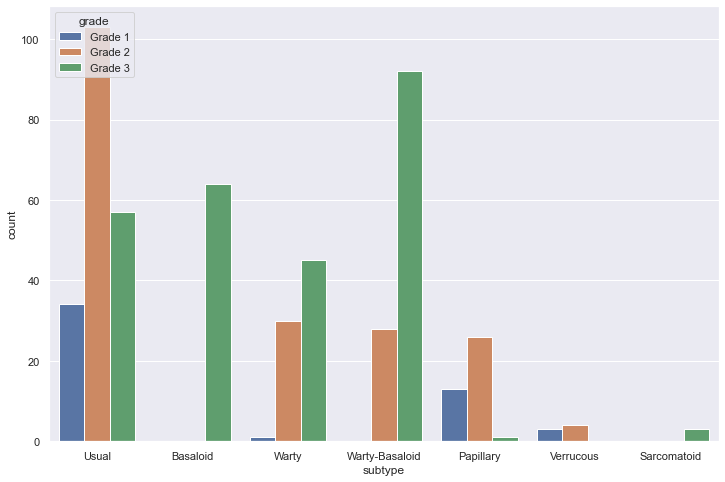


```python
# Association between subtype and grade
do_chi2('subtype','grade')
```

    Chi2 statistic: 200.979
    Degrees of freedom: 12
    P value: 2.04809e-36
    

### Histologic subtype and host response


```python
# Pivot table of subtype by host response
create_pivot('subtype','host_response')
```


<div>
<style scoped>
    .dataframe tbody tr th:only-of-type {
        vertical-align: middle;
    }

    .dataframe tbody tr th {
        vertical-align: top;
    }

    .dataframe thead th {
        text-align: right;
    }
</style>
<table border="1" class="dataframe">
  <thead>
    <tr style="text-align: right;">
      <th>host_response</th>
      <th>No</th>
      <th>Mild</th>
      <th>Moderate</th>
      <th>Intense</th>
    </tr>
    <tr>
      <th>subtype</th>
      <th></th>
      <th></th>
      <th></th>
      <th></th>
    </tr>
  </thead>
  <tbody>
    <tr>
      <th>Usual</th>
      <td>0</td>
      <td>36</td>
      <td>61</td>
      <td>95</td>
    </tr>
    <tr>
      <th>Basaloid</th>
      <td>1</td>
      <td>12</td>
      <td>17</td>
      <td>34</td>
    </tr>
    <tr>
      <th>Warty</th>
      <td>1</td>
      <td>14</td>
      <td>21</td>
      <td>41</td>
    </tr>
    <tr>
      <th>Warty-Basaloid</th>
      <td>1</td>
      <td>22</td>
      <td>41</td>
      <td>57</td>
    </tr>
    <tr>
      <th>Papillary</th>
      <td>1</td>
      <td>7</td>
      <td>14</td>
      <td>18</td>
    </tr>
    <tr>
      <th>Verrucous</th>
      <td>0</td>
      <td>5</td>
      <td>0</td>
      <td>2</td>
    </tr>
    <tr>
      <th>Sarcomatoid</th>
      <td>0</td>
      <td>0</td>
      <td>0</td>
      <td>3</td>
    </tr>
  </tbody>
</table>
</div>


```python
# barplot of subtype by host response
plot_bar('subtype','host_response')
```


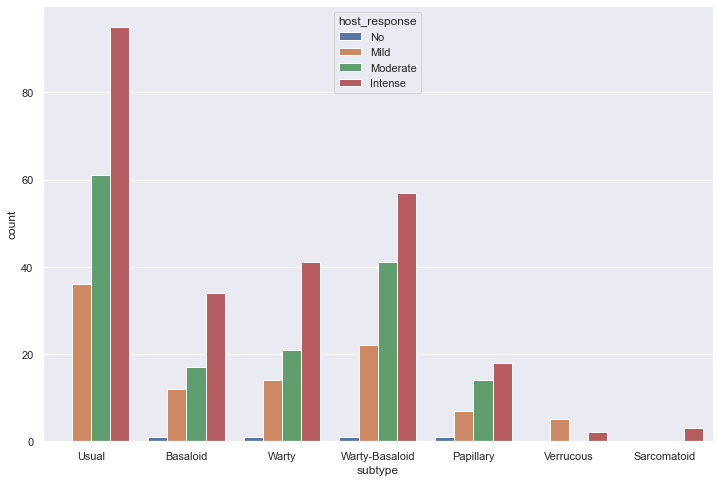


```python
# Association between subtype and host response
do_chi2('subtype','host_response')
```

    Chi2 statistic: 21.8924
    Degrees of freedom: 18
    P value: 0.236796
    

### Histologic grade and host response


```python
# Pivot table pf grade by host response
create_pivot('grade','host_response')
```


<div>
<style scoped>
    .dataframe tbody tr th:only-of-type {
        vertical-align: middle;
    }

    .dataframe tbody tr th {
        vertical-align: top;
    }

    .dataframe thead th {
        text-align: right;
    }
</style>
<table border="1" class="dataframe">
  <thead>
    <tr style="text-align: right;">
      <th>host_response</th>
      <th>No</th>
      <th>Mild</th>
      <th>Moderate</th>
      <th>Intense</th>
    </tr>
    <tr>
      <th>grade</th>
      <th></th>
      <th></th>
      <th></th>
      <th></th>
    </tr>
  </thead>
  <tbody>
    <tr>
      <th>Grade 1</th>
      <td>1</td>
      <td>15</td>
      <td>18</td>
      <td>17</td>
    </tr>
    <tr>
      <th>Grade 2</th>
      <td>1</td>
      <td>36</td>
      <td>59</td>
      <td>93</td>
    </tr>
    <tr>
      <th>Grade 3</th>
      <td>2</td>
      <td>45</td>
      <td>74</td>
      <td>137</td>
    </tr>
  </tbody>
</table>
</div>


```python
# Barplot of grade by host response
plot_bar('grade','host_response')
```


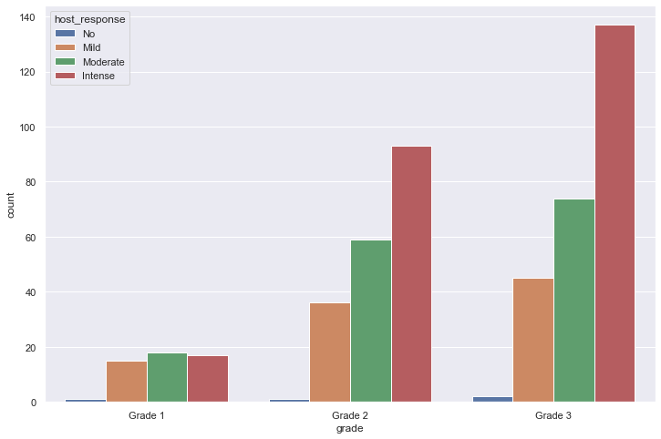


```python
# Association between grade and host response
do_chi2('grade','host_response')
```

    Chi2 statistic: 8.26221
    Degrees of freedom: 6
    P value: 0.219515
    

# PD-L1

PD-L1 expression was measured in tumor cells (percentage of positive cells and H-score) and in intratumoral lymphocytes (number of positive cells).

## Overall expression

### Tumor cells (%)


```python
create_descriptive('pdl1_tumor')
```


<div>
<style scoped>
    .dataframe tbody tr th:only-of-type {
        vertical-align: middle;
    }

    .dataframe tbody tr th {
        vertical-align: top;
    }

    .dataframe thead th {
        text-align: right;
    }
</style>
<table border="1" class="dataframe">
  <thead>
    <tr style="text-align: right;">
      <th></th>
      <th>pdl1_tumor</th>
    </tr>
  </thead>
  <tbody>
    <tr>
      <th>count</th>
      <td>504.0</td>
    </tr>
    <tr>
      <th>mean</th>
      <td>26.0</td>
    </tr>
    <tr>
      <th>std</th>
      <td>34.0</td>
    </tr>
    <tr>
      <th>min</th>
      <td>0.0</td>
    </tr>
    <tr>
      <th>25%</th>
      <td>0.0</td>
    </tr>
    <tr>
      <th>50%</th>
      <td>5.0</td>
    </tr>
    <tr>
      <th>75%</th>
      <td>40.0</td>
    </tr>
    <tr>
      <th>max</th>
      <td>100.0</td>
    </tr>
  </tbody>
</table>
</div>


```python
plot_kde('pdl1_tumor')
```


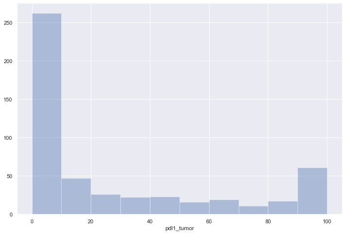


```python
pdl1_tumor_pos1 = df['pdl1_tumor'].apply(lambda x: 'Positive' if x > 0 else 'Negative')
pdl1_tumor_pos1.value_counts().to_frame()
```


<div>
<style scoped>
    .dataframe tbody tr th:only-of-type {
        vertical-align: middle;
    }

    .dataframe tbody tr th {
        vertical-align: top;
    }

    .dataframe thead th {
        text-align: right;
    }
</style>
<table border="1" class="dataframe">
  <thead>
    <tr style="text-align: right;">
      <th></th>
      <th>pdl1_tumor</th>
    </tr>
  </thead>
  <tbody>
    <tr>
      <th>Positive</th>
      <td>331</td>
    </tr>
    <tr>
      <th>Negative</th>
      <td>197</td>
    </tr>
  </tbody>
</table>
</div>


```python
df['pdl1_tumor_location'].value_counts().to_frame()
```


<div>
<style scoped>
    .dataframe tbody tr th:only-of-type {
        vertical-align: middle;
    }

    .dataframe tbody tr th {
        vertical-align: top;
    }

    .dataframe thead th {
        text-align: right;
    }
</style>
<table border="1" class="dataframe">
  <thead>
    <tr style="text-align: right;">
      <th></th>
      <th>pdl1_tumor_location</th>
    </tr>
  </thead>
  <tbody>
    <tr>
      <th>Cytoplasmic/Membraneous</th>
      <td>250</td>
    </tr>
    <tr>
      <th>Cytplasmic</th>
      <td>81</td>
    </tr>
  </tbody>
</table>
</div>


### Tumor cells (H-score)


```python
create_descriptive('pdl1_tumor_h')
```


<div>
<style scoped>
    .dataframe tbody tr th:only-of-type {
        vertical-align: middle;
    }

    .dataframe tbody tr th {
        vertical-align: top;
    }

    .dataframe thead th {
        text-align: right;
    }
</style>
<table border="1" class="dataframe">
  <thead>
    <tr style="text-align: right;">
      <th></th>
      <th>pdl1_tumor_h</th>
    </tr>
  </thead>
  <tbody>
    <tr>
      <th>count</th>
      <td>504.0</td>
    </tr>
    <tr>
      <th>mean</th>
      <td>36.0</td>
    </tr>
    <tr>
      <th>std</th>
      <td>60.0</td>
    </tr>
    <tr>
      <th>min</th>
      <td>0.0</td>
    </tr>
    <tr>
      <th>25%</th>
      <td>0.0</td>
    </tr>
    <tr>
      <th>50%</th>
      <td>5.0</td>
    </tr>
    <tr>
      <th>75%</th>
      <td>50.0</td>
    </tr>
    <tr>
      <th>max</th>
      <td>300.0</td>
    </tr>
  </tbody>
</table>
</div>


```python
plot_kde('pdl1_tumor_h')
```


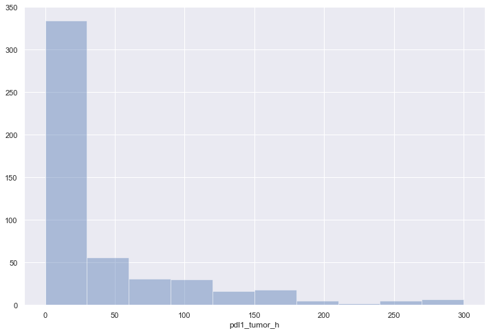


### Intratumoral lymphocytes


```python
create_descriptive('pdl1_lymph')
```


<div>
<style scoped>
    .dataframe tbody tr th:only-of-type {
        vertical-align: middle;
    }

    .dataframe tbody tr th {
        vertical-align: top;
    }

    .dataframe thead th {
        text-align: right;
    }
</style>
<table border="1" class="dataframe">
  <thead>
    <tr style="text-align: right;">
      <th></th>
      <th>pdl1_lymph</th>
    </tr>
  </thead>
  <tbody>
    <tr>
      <th>count</th>
      <td>497.0</td>
    </tr>
    <tr>
      <th>mean</th>
      <td>7.0</td>
    </tr>
    <tr>
      <th>std</th>
      <td>10.0</td>
    </tr>
    <tr>
      <th>min</th>
      <td>0.0</td>
    </tr>
    <tr>
      <th>25%</th>
      <td>1.0</td>
    </tr>
    <tr>
      <th>50%</th>
      <td>5.0</td>
    </tr>
    <tr>
      <th>75%</th>
      <td>10.0</td>
    </tr>
    <tr>
      <th>max</th>
      <td>70.0</td>
    </tr>
  </tbody>
</table>
</div>


```python
sns.distplot(df['pdl1_lymph'], kde=False, bins=10)
```


    <AxesSubplot:xlabel='pdl1_lymph'>


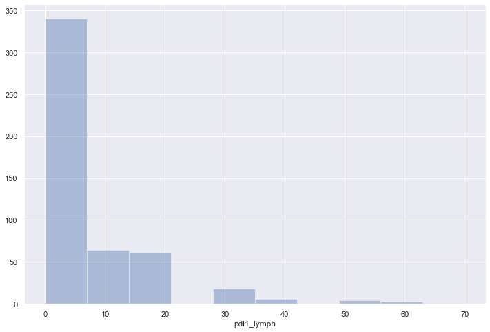


## Histologic subtype

### Tumor cells (%)


```python
create_descriptives('pdl1_tumor','subtype')
```


<div>
<style scoped>
    .dataframe tbody tr th:only-of-type {
        vertical-align: middle;
    }

    .dataframe tbody tr th {
        vertical-align: top;
    }

    .dataframe thead th {
        text-align: right;
    }
</style>
<table border="1" class="dataframe">
  <thead>
    <tr style="text-align: right;">
      <th></th>
      <th>count</th>
      <th>mean</th>
      <th>std</th>
      <th>min</th>
      <th>25%</th>
      <th>50%</th>
      <th>75%</th>
      <th>max</th>
    </tr>
    <tr>
      <th>subtype</th>
      <th></th>
      <th></th>
      <th></th>
      <th></th>
      <th></th>
      <th></th>
      <th></th>
      <th></th>
    </tr>
  </thead>
  <tbody>
    <tr>
      <th>Usual</th>
      <td>192.0</td>
      <td>25.0</td>
      <td>35.0</td>
      <td>0.0</td>
      <td>0.0</td>
      <td>5.0</td>
      <td>50.0</td>
      <td>100.0</td>
    </tr>
    <tr>
      <th>Basaloid</th>
      <td>64.0</td>
      <td>32.0</td>
      <td>32.0</td>
      <td>0.0</td>
      <td>0.0</td>
      <td>25.0</td>
      <td>50.0</td>
      <td>100.0</td>
    </tr>
    <tr>
      <th>Warty</th>
      <td>77.0</td>
      <td>15.0</td>
      <td>23.0</td>
      <td>0.0</td>
      <td>0.0</td>
      <td>5.0</td>
      <td>20.0</td>
      <td>90.0</td>
    </tr>
    <tr>
      <th>Warty-Basaloid</th>
      <td>121.0</td>
      <td>37.0</td>
      <td>39.0</td>
      <td>0.0</td>
      <td>2.0</td>
      <td>20.0</td>
      <td>80.0</td>
      <td>100.0</td>
    </tr>
    <tr>
      <th>Papillary</th>
      <td>40.0</td>
      <td>1.0</td>
      <td>4.0</td>
      <td>0.0</td>
      <td>0.0</td>
      <td>0.0</td>
      <td>0.0</td>
      <td>20.0</td>
    </tr>
    <tr>
      <th>Verrucous</th>
      <td>7.0</td>
      <td>0.0</td>
      <td>0.0</td>
      <td>0.0</td>
      <td>0.0</td>
      <td>0.0</td>
      <td>0.0</td>
      <td>0.0</td>
    </tr>
    <tr>
      <th>Sarcomatoid</th>
      <td>3.0</td>
      <td>100.0</td>
      <td>0.0</td>
      <td>100.0</td>
      <td>100.0</td>
      <td>100.0</td>
      <td>100.0</td>
      <td>100.0</td>
    </tr>
  </tbody>
</table>
</div>


```python
plot_box('pdl1_tumor', 'subtype')
```


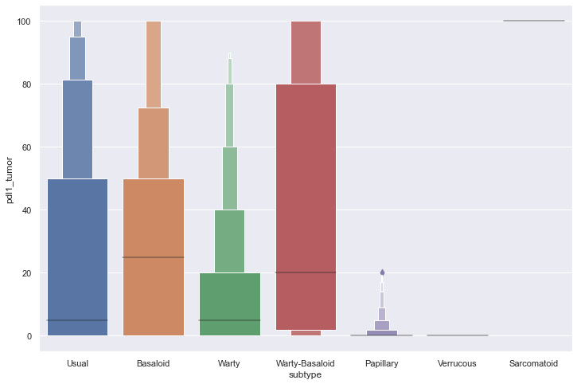


```python
do_kw('pdl1_tumor', 'subtype')
```

    Kruskal-Wallis statistic: 77.2567
    P value: 1.31578e-14
    

### Tumor cells (H-score)


```python
create_descriptives('pdl1_tumor_h','subtype')
```


<div>
<style scoped>
    .dataframe tbody tr th:only-of-type {
        vertical-align: middle;
    }

    .dataframe tbody tr th {
        vertical-align: top;
    }

    .dataframe thead th {
        text-align: right;
    }
</style>
<table border="1" class="dataframe">
  <thead>
    <tr style="text-align: right;">
      <th></th>
      <th>count</th>
      <th>mean</th>
      <th>std</th>
      <th>min</th>
      <th>25%</th>
      <th>50%</th>
      <th>75%</th>
      <th>max</th>
    </tr>
    <tr>
      <th>subtype</th>
      <th></th>
      <th></th>
      <th></th>
      <th></th>
      <th></th>
      <th></th>
      <th></th>
      <th></th>
    </tr>
  </thead>
  <tbody>
    <tr>
      <th>Usual</th>
      <td>192.0</td>
      <td>38.0</td>
      <td>60.0</td>
      <td>0.0</td>
      <td>0.0</td>
      <td>5.0</td>
      <td>56.0</td>
      <td>280.0</td>
    </tr>
    <tr>
      <th>Basaloid</th>
      <td>64.0</td>
      <td>36.0</td>
      <td>39.0</td>
      <td>0.0</td>
      <td>0.0</td>
      <td>28.0</td>
      <td>50.0</td>
      <td>150.0</td>
    </tr>
    <tr>
      <th>Warty</th>
      <td>77.0</td>
      <td>16.0</td>
      <td>25.0</td>
      <td>0.0</td>
      <td>0.0</td>
      <td>5.0</td>
      <td>20.0</td>
      <td>100.0</td>
    </tr>
    <tr>
      <th>Warty-Basaloid</th>
      <td>121.0</td>
      <td>55.0</td>
      <td>71.0</td>
      <td>0.0</td>
      <td>2.0</td>
      <td>20.0</td>
      <td>90.0</td>
      <td>300.0</td>
    </tr>
    <tr>
      <th>Papillary</th>
      <td>40.0</td>
      <td>1.0</td>
      <td>5.0</td>
      <td>0.0</td>
      <td>0.0</td>
      <td>0.0</td>
      <td>0.0</td>
      <td>25.0</td>
    </tr>
    <tr>
      <th>Verrucous</th>
      <td>7.0</td>
      <td>0.0</td>
      <td>0.0</td>
      <td>0.0</td>
      <td>0.0</td>
      <td>0.0</td>
      <td>0.0</td>
      <td>0.0</td>
    </tr>
    <tr>
      <th>Sarcomatoid</th>
      <td>3.0</td>
      <td>293.0</td>
      <td>12.0</td>
      <td>280.0</td>
      <td>290.0</td>
      <td>300.0</td>
      <td>300.0</td>
      <td>300.0</td>
    </tr>
  </tbody>
</table>
</div>


```python
plot_box('pdl1_tumor_h','subtype')
```


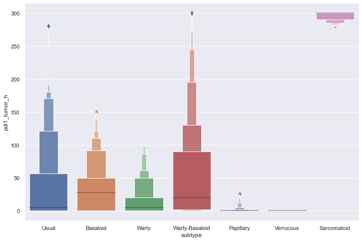


```python
do_kw('pdl1_tumor_h','subtype')
```

    Kruskal-Wallis statistic: 76.2364
    P value: 2.13539e-14
    

### Intratumoral lymphocytes


```python
create_descriptives('pdl1_lymph','subtype')
```


<div>
<style scoped>
    .dataframe tbody tr th:only-of-type {
        vertical-align: middle;
    }

    .dataframe tbody tr th {
        vertical-align: top;
    }

    .dataframe thead th {
        text-align: right;
    }
</style>
<table border="1" class="dataframe">
  <thead>
    <tr style="text-align: right;">
      <th></th>
      <th>count</th>
      <th>mean</th>
      <th>std</th>
      <th>min</th>
      <th>25%</th>
      <th>50%</th>
      <th>75%</th>
      <th>max</th>
    </tr>
    <tr>
      <th>subtype</th>
      <th></th>
      <th></th>
      <th></th>
      <th></th>
      <th></th>
      <th></th>
      <th></th>
      <th></th>
    </tr>
  </thead>
  <tbody>
    <tr>
      <th>Usual</th>
      <td>192.0</td>
      <td>9.0</td>
      <td>12.0</td>
      <td>0.0</td>
      <td>1.0</td>
      <td>5.0</td>
      <td>10.0</td>
      <td>70.0</td>
    </tr>
    <tr>
      <th>Basaloid</th>
      <td>63.0</td>
      <td>9.0</td>
      <td>12.0</td>
      <td>0.0</td>
      <td>2.0</td>
      <td>5.0</td>
      <td>10.0</td>
      <td>60.0</td>
    </tr>
    <tr>
      <th>Warty</th>
      <td>75.0</td>
      <td>6.0</td>
      <td>9.0</td>
      <td>0.0</td>
      <td>0.0</td>
      <td>5.0</td>
      <td>6.0</td>
      <td>40.0</td>
    </tr>
    <tr>
      <th>Warty-Basaloid</th>
      <td>120.0</td>
      <td>6.0</td>
      <td>8.0</td>
      <td>0.0</td>
      <td>1.0</td>
      <td>5.0</td>
      <td>10.0</td>
      <td>50.0</td>
    </tr>
    <tr>
      <th>Papillary</th>
      <td>37.0</td>
      <td>3.0</td>
      <td>4.0</td>
      <td>0.0</td>
      <td>0.0</td>
      <td>2.0</td>
      <td>5.0</td>
      <td>20.0</td>
    </tr>
    <tr>
      <th>Verrucous</th>
      <td>7.0</td>
      <td>0.0</td>
      <td>1.0</td>
      <td>0.0</td>
      <td>0.0</td>
      <td>0.0</td>
      <td>0.0</td>
      <td>2.0</td>
    </tr>
    <tr>
      <th>Sarcomatoid</th>
      <td>3.0</td>
      <td>18.0</td>
      <td>10.0</td>
      <td>10.0</td>
      <td>12.0</td>
      <td>15.0</td>
      <td>22.0</td>
      <td>30.0</td>
    </tr>
  </tbody>
</table>
</div>


```python
plot_box('pdl1_lymph','subtype')
```


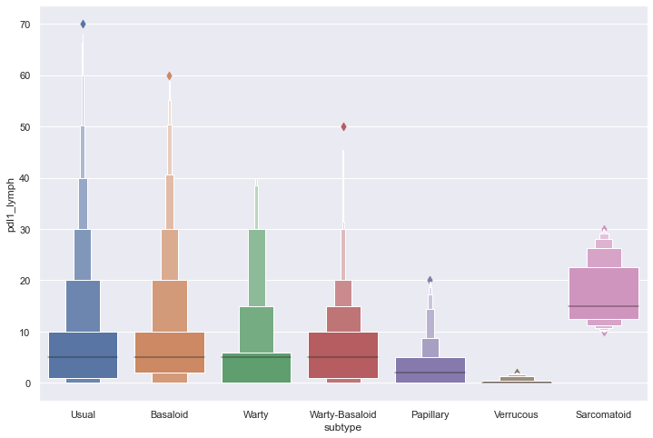


```python
do_kw('pdl1_lymph','subtype')
```

    Kruskal-Wallis statistic: 29.7604
    P value: 4.36519e-05
    

## Histologic grade

### Tumor cells (%)


```python
create_descriptives('pdl1_tumor','grade')
```


<div>
<style scoped>
    .dataframe tbody tr th:only-of-type {
        vertical-align: middle;
    }

    .dataframe tbody tr th {
        vertical-align: top;
    }

    .dataframe thead th {
        text-align: right;
    }
</style>
<table border="1" class="dataframe">
  <thead>
    <tr style="text-align: right;">
      <th></th>
      <th>count</th>
      <th>mean</th>
      <th>std</th>
      <th>min</th>
      <th>25%</th>
      <th>50%</th>
      <th>75%</th>
      <th>max</th>
    </tr>
    <tr>
      <th>grade</th>
      <th></th>
      <th></th>
      <th></th>
      <th></th>
      <th></th>
      <th></th>
      <th></th>
      <th></th>
    </tr>
  </thead>
  <tbody>
    <tr>
      <th>Grade 1</th>
      <td>51.0</td>
      <td>8.0</td>
      <td>21.0</td>
      <td>0.0</td>
      <td>0.0</td>
      <td>0.0</td>
      <td>5.0</td>
      <td>90.0</td>
    </tr>
    <tr>
      <th>Grade 2</th>
      <td>189.0</td>
      <td>21.0</td>
      <td>34.0</td>
      <td>0.0</td>
      <td>0.0</td>
      <td>1.0</td>
      <td>30.0</td>
      <td>100.0</td>
    </tr>
    <tr>
      <th>Grade 3</th>
      <td>258.0</td>
      <td>32.0</td>
      <td>36.0</td>
      <td>0.0</td>
      <td>1.0</td>
      <td>15.0</td>
      <td>60.0</td>
      <td>100.0</td>
    </tr>
  </tbody>
</table>
</div>


```python
plot_box('pdl1_tumor','grade')
```


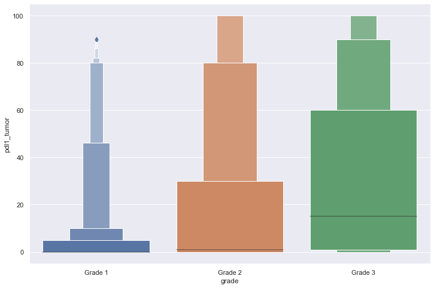


```python
plot_point('pdl1_tumor','grade')
```


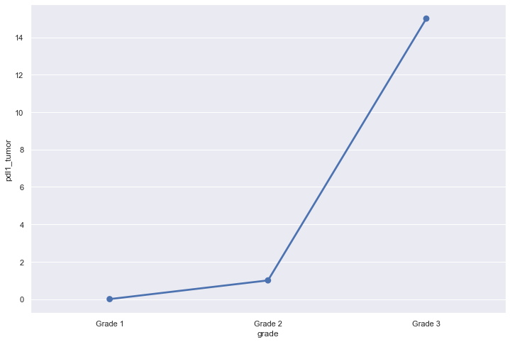


```python
do_kw('pdl1_tumor','grade')
```

    Kruskal-Wallis statistic: 45.0078
    P value: 1.6853e-10
    

### Tumor cells (H-score)


```python
create_descriptives('pdl1_tumor_h','grade')
```


<div>
<style scoped>
    .dataframe tbody tr th:only-of-type {
        vertical-align: middle;
    }

    .dataframe tbody tr th {
        vertical-align: top;
    }

    .dataframe thead th {
        text-align: right;
    }
</style>
<table border="1" class="dataframe">
  <thead>
    <tr style="text-align: right;">
      <th></th>
      <th>count</th>
      <th>mean</th>
      <th>std</th>
      <th>min</th>
      <th>25%</th>
      <th>50%</th>
      <th>75%</th>
      <th>max</th>
    </tr>
    <tr>
      <th>grade</th>
      <th></th>
      <th></th>
      <th></th>
      <th></th>
      <th></th>
      <th></th>
      <th></th>
      <th></th>
    </tr>
  </thead>
  <tbody>
    <tr>
      <th>Grade 1</th>
      <td>51.0</td>
      <td>12.0</td>
      <td>35.0</td>
      <td>0.0</td>
      <td>0.0</td>
      <td>0.0</td>
      <td>5.0</td>
      <td>160.0</td>
    </tr>
    <tr>
      <th>Grade 2</th>
      <td>189.0</td>
      <td>29.0</td>
      <td>51.0</td>
      <td>0.0</td>
      <td>0.0</td>
      <td>1.0</td>
      <td>35.0</td>
      <td>250.0</td>
    </tr>
    <tr>
      <th>Grade 3</th>
      <td>258.0</td>
      <td>47.0</td>
      <td>67.0</td>
      <td>0.0</td>
      <td>1.0</td>
      <td>18.0</td>
      <td>64.0</td>
      <td>300.0</td>
    </tr>
  </tbody>
</table>
</div>


```python
plot_box('pdl1_tumor_h','grade')
```


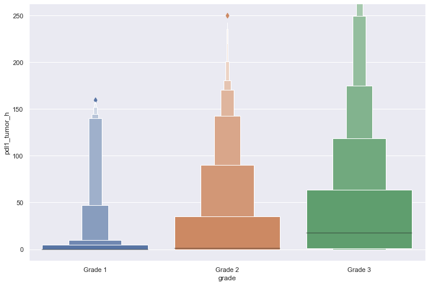


```python
plot_point('pdl1_tumor_h','grade')
```


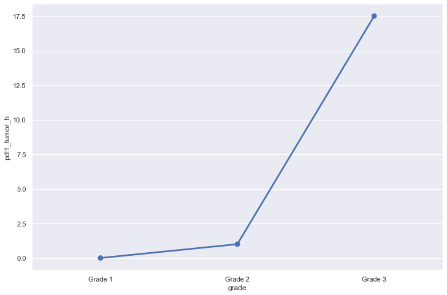


```python
do_kw('pdl1_tumor_h','grade')
```

    Kruskal-Wallis statistic: 44.1817
    P value: 2.54727e-10
    

### Intratumoral lymphocytes


```python
create_descriptives('pdl1_lymph','grade')
```


<div>
<style scoped>
    .dataframe tbody tr th:only-of-type {
        vertical-align: middle;
    }

    .dataframe tbody tr th {
        vertical-align: top;
    }

    .dataframe thead th {
        text-align: right;
    }
</style>
<table border="1" class="dataframe">
  <thead>
    <tr style="text-align: right;">
      <th></th>
      <th>count</th>
      <th>mean</th>
      <th>std</th>
      <th>min</th>
      <th>25%</th>
      <th>50%</th>
      <th>75%</th>
      <th>max</th>
    </tr>
    <tr>
      <th>grade</th>
      <th></th>
      <th></th>
      <th></th>
      <th></th>
      <th></th>
      <th></th>
      <th></th>
      <th></th>
    </tr>
  </thead>
  <tbody>
    <tr>
      <th>Grade 1</th>
      <td>48.0</td>
      <td>9.0</td>
      <td>14.0</td>
      <td>0.0</td>
      <td>1.0</td>
      <td>2.0</td>
      <td>6.0</td>
      <td>60.0</td>
    </tr>
    <tr>
      <th>Grade 2</th>
      <td>187.0</td>
      <td>6.0</td>
      <td>9.0</td>
      <td>0.0</td>
      <td>0.0</td>
      <td>2.0</td>
      <td>8.0</td>
      <td>60.0</td>
    </tr>
    <tr>
      <th>Grade 3</th>
      <td>256.0</td>
      <td>8.0</td>
      <td>11.0</td>
      <td>0.0</td>
      <td>1.0</td>
      <td>5.0</td>
      <td>10.0</td>
      <td>70.0</td>
    </tr>
  </tbody>
</table>
</div>


```python
plot_box('pdl1_lymph','grade')
```


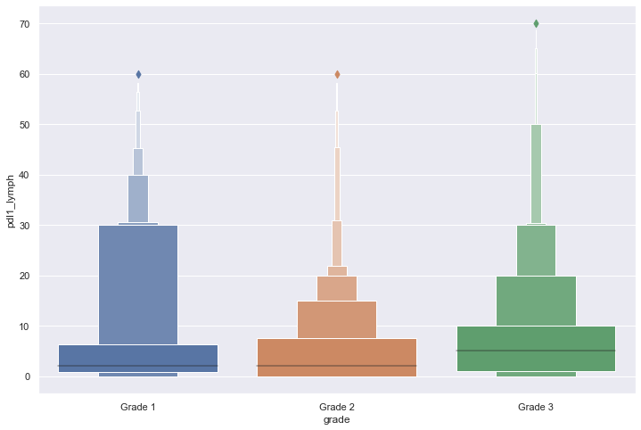


```python
plot_point('pdl1_lymph','grade')
```


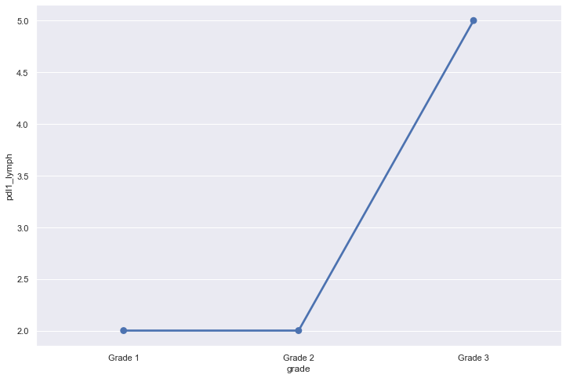


```python
do_kw('pdl1_lymph','grade')
```

    Kruskal-Wallis statistic: 8.57222
    P value: 0.0137584
    

## Host response

### Tumor cells (%)


```python
create_descriptives('pdl1_tumor','host_response')
```


<div>
<style scoped>
    .dataframe tbody tr th:only-of-type {
        vertical-align: middle;
    }

    .dataframe tbody tr th {
        vertical-align: top;
    }

    .dataframe thead th {
        text-align: right;
    }
</style>
<table border="1" class="dataframe">
  <thead>
    <tr style="text-align: right;">
      <th></th>
      <th>count</th>
      <th>mean</th>
      <th>std</th>
      <th>min</th>
      <th>25%</th>
      <th>50%</th>
      <th>75%</th>
      <th>max</th>
    </tr>
    <tr>
      <th>host_response</th>
      <th></th>
      <th></th>
      <th></th>
      <th></th>
      <th></th>
      <th></th>
      <th></th>
      <th></th>
    </tr>
  </thead>
  <tbody>
    <tr>
      <th>No</th>
      <td>4.0</td>
      <td>25.0</td>
      <td>50.0</td>
      <td>0.0</td>
      <td>0.0</td>
      <td>0.0</td>
      <td>25.0</td>
      <td>100.0</td>
    </tr>
    <tr>
      <th>Mild</th>
      <td>96.0</td>
      <td>16.0</td>
      <td>27.0</td>
      <td>0.0</td>
      <td>0.0</td>
      <td>1.0</td>
      <td>20.0</td>
      <td>100.0</td>
    </tr>
    <tr>
      <th>Moderate</th>
      <td>154.0</td>
      <td>19.0</td>
      <td>30.0</td>
      <td>0.0</td>
      <td>0.0</td>
      <td>2.0</td>
      <td>20.0</td>
      <td>100.0</td>
    </tr>
    <tr>
      <th>Intense</th>
      <td>250.0</td>
      <td>34.0</td>
      <td>37.0</td>
      <td>0.0</td>
      <td>0.0</td>
      <td>15.0</td>
      <td>60.0</td>
      <td>100.0</td>
    </tr>
  </tbody>
</table>
</div>


```python
plot_box('pdl1_tumor','host_response')
```


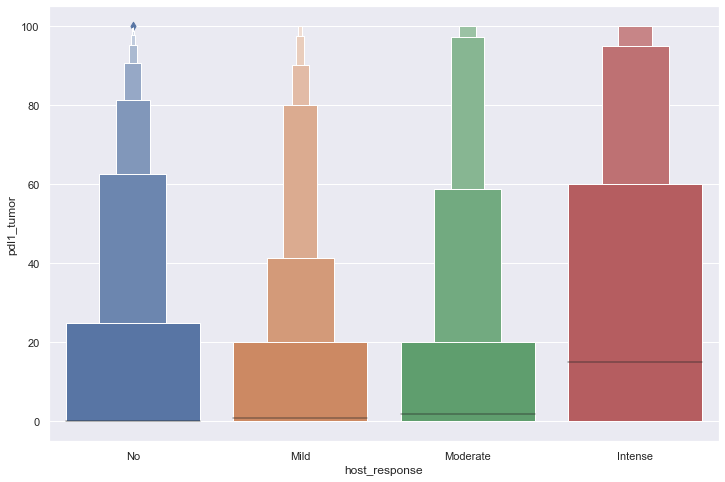


```python
plot_point('pdl1_tumor','host_response')
```


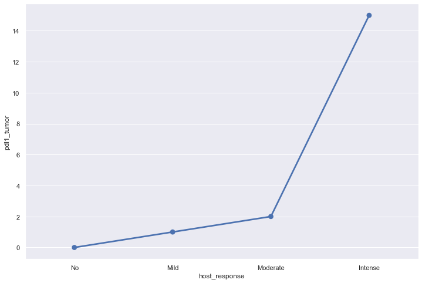


```python
do_kw('pdl1_tumor','host_response')
```

    Kruskal-Wallis statistic: 26.7672
    P value: 6.58739e-06
    

### Tumor cells (H-score)


```python
create_descriptives('pdl1_tumor_h','host_response')
```


<div>
<style scoped>
    .dataframe tbody tr th:only-of-type {
        vertical-align: middle;
    }

    .dataframe tbody tr th {
        vertical-align: top;
    }

    .dataframe thead th {
        text-align: right;
    }
</style>
<table border="1" class="dataframe">
  <thead>
    <tr style="text-align: right;">
      <th></th>
      <th>count</th>
      <th>mean</th>
      <th>std</th>
      <th>min</th>
      <th>25%</th>
      <th>50%</th>
      <th>75%</th>
      <th>max</th>
    </tr>
    <tr>
      <th>host_response</th>
      <th></th>
      <th></th>
      <th></th>
      <th></th>
      <th></th>
      <th></th>
      <th></th>
      <th></th>
    </tr>
  </thead>
  <tbody>
    <tr>
      <th>No</th>
      <td>4.0</td>
      <td>75.0</td>
      <td>150.0</td>
      <td>0.0</td>
      <td>0.0</td>
      <td>0.0</td>
      <td>75.0</td>
      <td>300.0</td>
    </tr>
    <tr>
      <th>Mild</th>
      <td>96.0</td>
      <td>20.0</td>
      <td>36.0</td>
      <td>0.0</td>
      <td>0.0</td>
      <td>1.0</td>
      <td>20.0</td>
      <td>150.0</td>
    </tr>
    <tr>
      <th>Moderate</th>
      <td>154.0</td>
      <td>26.0</td>
      <td>51.0</td>
      <td>0.0</td>
      <td>0.0</td>
      <td>2.0</td>
      <td>26.0</td>
      <td>280.0</td>
    </tr>
    <tr>
      <th>Intense</th>
      <td>250.0</td>
      <td>49.0</td>
      <td>66.0</td>
      <td>0.0</td>
      <td>0.0</td>
      <td>18.0</td>
      <td>80.0</td>
      <td>300.0</td>
    </tr>
  </tbody>
</table>
</div>


```python
plot_box('pdl1_tumor_h','host_response')
```


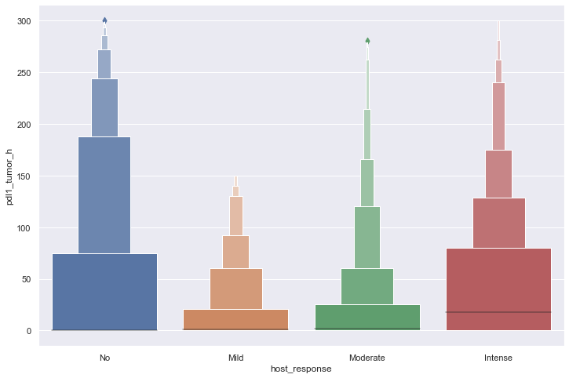


```python
plot_point('pdl1_tumor_h','host_response')
```


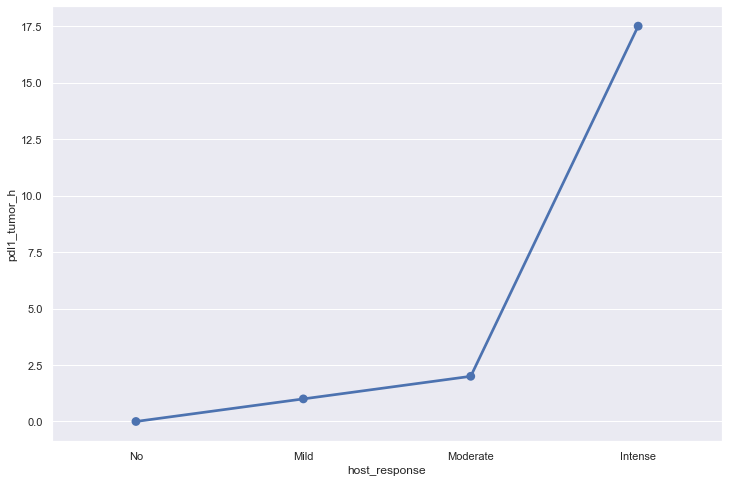


```python
do_kw('pdl1_tumor_h','host_response')
```

    Kruskal-Wallis statistic: 26.1745
    P value: 8.76797e-06
    

### Intratumoral lymphocytes


```python
create_descriptives('pdl1_lymph','host_response')
```


<div>
<style scoped>
    .dataframe tbody tr th:only-of-type {
        vertical-align: middle;
    }

    .dataframe tbody tr th {
        vertical-align: top;
    }

    .dataframe thead th {
        text-align: right;
    }
</style>
<table border="1" class="dataframe">
  <thead>
    <tr style="text-align: right;">
      <th></th>
      <th>count</th>
      <th>mean</th>
      <th>std</th>
      <th>min</th>
      <th>25%</th>
      <th>50%</th>
      <th>75%</th>
      <th>max</th>
    </tr>
    <tr>
      <th>host_response</th>
      <th></th>
      <th></th>
      <th></th>
      <th></th>
      <th></th>
      <th></th>
      <th></th>
      <th></th>
    </tr>
  </thead>
  <tbody>
    <tr>
      <th>No</th>
      <td>0.0</td>
      <td>NaN</td>
      <td>NaN</td>
      <td>NaN</td>
      <td>NaN</td>
      <td>NaN</td>
      <td>NaN</td>
      <td>NaN</td>
    </tr>
    <tr>
      <th>Mild</th>
      <td>93.0</td>
      <td>4.0</td>
      <td>10.0</td>
      <td>0.0</td>
      <td>0.0</td>
      <td>1.0</td>
      <td>2.0</td>
      <td>70.0</td>
    </tr>
    <tr>
      <th>Moderate</th>
      <td>154.0</td>
      <td>4.0</td>
      <td>5.0</td>
      <td>0.0</td>
      <td>1.0</td>
      <td>2.0</td>
      <td>5.0</td>
      <td>30.0</td>
    </tr>
    <tr>
      <th>Intense</th>
      <td>250.0</td>
      <td>11.0</td>
      <td>12.0</td>
      <td>0.0</td>
      <td>2.0</td>
      <td>5.0</td>
      <td>15.0</td>
      <td>60.0</td>
    </tr>
  </tbody>
</table>
</div>


```python
plot_box('pdl1_lymph','host_response')
```


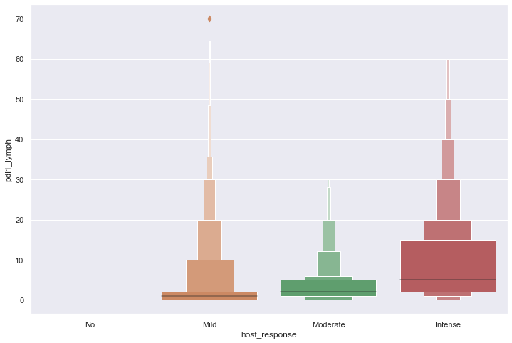


```python
plot_point('pdl1_lymph','host_response')
```


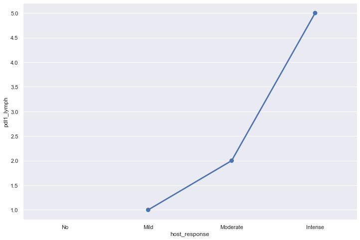


```python
do_kw('pdl1_lymph','host_response')
```

    Kruskal-Wallis statistic: 89.7395
    P value: 2.49182e-19
    

## Correlation matrix


```python
vars = ['pdl1_tumor','pdl1_tumor_h','pdl1_lymph']
```

### Pairplot


```python
plot_pair(vars)
```


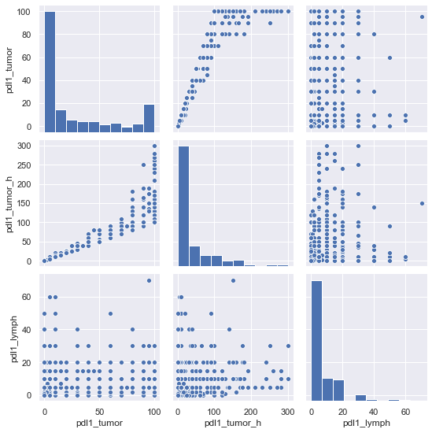


### Correlation coefficients


```python
do_spearman_rho(vars)
```


<div>
<style scoped>
    .dataframe tbody tr th:only-of-type {
        vertical-align: middle;
    }

    .dataframe tbody tr th {
        vertical-align: top;
    }

    .dataframe thead th {
        text-align: right;
    }
</style>
<table border="1" class="dataframe">
  <thead>
    <tr style="text-align: right;">
      <th></th>
      <th>pdl1_tumor</th>
      <th>pdl1_tumor_h</th>
      <th>pdl1_lymph</th>
    </tr>
  </thead>
  <tbody>
    <tr>
      <th>pdl1_tumor</th>
      <td>1.00</td>
      <td>1.00</td>
      <td>0.47</td>
    </tr>
    <tr>
      <th>pdl1_tumor_h</th>
      <td>1.00</td>
      <td>1.00</td>
      <td>0.48</td>
    </tr>
    <tr>
      <th>pdl1_lymph</th>
      <td>0.47</td>
      <td>0.48</td>
      <td>1.00</td>
    </tr>
  </tbody>
</table>
</div>


### P values


```python
do_spearman_p(vars)
```


<div>
<style scoped>
    .dataframe tbody tr th:only-of-type {
        vertical-align: middle;
    }

    .dataframe tbody tr th {
        vertical-align: top;
    }

    .dataframe thead th {
        text-align: right;
    }
</style>
<table border="1" class="dataframe">
  <thead>
    <tr style="text-align: right;">
      <th></th>
      <th>pdl1_tumor</th>
      <th>pdl1_tumor_h</th>
      <th>pdl1_lymph</th>
    </tr>
  </thead>
  <tbody>
    <tr>
      <th>pdl1_tumor</th>
      <td>0.000000e+00</td>
      <td>0.000000e+00</td>
      <td>2.545391e-29</td>
    </tr>
    <tr>
      <th>pdl1_tumor_h</th>
      <td>0.000000e+00</td>
      <td>0.000000e+00</td>
      <td>1.168989e-29</td>
    </tr>
    <tr>
      <th>pdl1_lymph</th>
      <td>2.545391e-29</td>
      <td>1.168989e-29</td>
      <td>0.000000e+00</td>
    </tr>
  </tbody>
</table>
</div>


## Impact of pathologic features

### Tumor cells (%)


```python
get_all_scores('pdl1_tumor')
```

    Variance explained by ['subtype']: 13.4973
    Variance explained by ['grade']: 3.5085
    Variance explained by ['host_response']: 6.52007
    Variance explained by ['subtype', 'grade']: 9.01939
    Variance explained by ['host_response', 'grade']: 9.56603
    Variance explained by ['subtype', 'host_response']: 19.9779
    Variance explained by ['subtype', 'grade', 'host_response']: 16.2733
    

### Tumor cells (H-score)


```python
get_all_scores('pdl1_tumor_h')
```

    Variance explained by ['subtype']: 8.69766
    Variance explained by ['grade']: 0.923613
    Variance explained by ['host_response']: 3.40178
    Variance explained by ['subtype', 'grade']: 4.07026
    Variance explained by ['host_response', 'grade']: 4.12818
    Variance explained by ['subtype', 'host_response']: 12.9631
    Variance explained by ['subtype', 'grade', 'host_response']: 8.82119
    

### Intratumoral lymphocytes


```python
get_all_scores('pdl1_lymph')
```

    Variance explained by ['subtype']: 4.09562
    Variance explained by ['grade']: 2.50952
    Variance explained by ['host_response']: 11.2489
    Variance explained by ['subtype', 'grade']: 5.60741
    Variance explained by ['host_response', 'grade']: 14.162
    Variance explained by ['subtype', 'host_response']: 13.9136
    Variance explained by ['subtype', 'grade', 'host_response']: 16.3493
    

# CD8 and Ki67

## Overall expression

### CD8 in intratumoral lymphocytes


```python
create_descriptive('cd8_intratumoral')
```


<div>
<style scoped>
    .dataframe tbody tr th:only-of-type {
        vertical-align: middle;
    }

    .dataframe tbody tr th {
        vertical-align: top;
    }

    .dataframe thead th {
        text-align: right;
    }
</style>
<table border="1" class="dataframe">
  <thead>
    <tr style="text-align: right;">
      <th></th>
      <th>cd8_intratumoral</th>
    </tr>
  </thead>
  <tbody>
    <tr>
      <th>count</th>
      <td>506.0</td>
    </tr>
    <tr>
      <th>mean</th>
      <td>10.0</td>
    </tr>
    <tr>
      <th>std</th>
      <td>16.0</td>
    </tr>
    <tr>
      <th>min</th>
      <td>0.0</td>
    </tr>
    <tr>
      <th>25%</th>
      <td>0.0</td>
    </tr>
    <tr>
      <th>50%</th>
      <td>4.0</td>
    </tr>
    <tr>
      <th>75%</th>
      <td>12.0</td>
    </tr>
    <tr>
      <th>max</th>
      <td>120.0</td>
    </tr>
  </tbody>
</table>
</div>


```python
plot_kde('cd8_intratumoral')
```


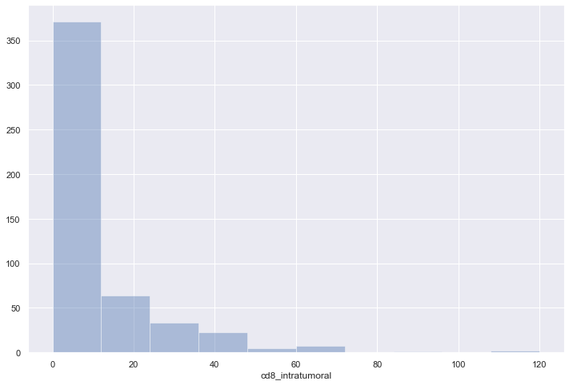


We observed a mean of 10 CD8+ intratumoral lymphocytes per spot (standard deviation of 16 CD8+ lymphocytes, with a range from 0 to 120 CD8+ lymphocytes). Most of spots showed a low count of CD8+ intratumoral lymphocytes, with 50% of spots showing 4 or less CD8+ lymphocytes and 75% of spots showing 12 or less CD8+ positive lymphocytes.

### CD8-Ki67 in intratumoral lymphocytes


```python
create_descriptive('cd8ki67_intratumoral')
```


<div>
<style scoped>
    .dataframe tbody tr th:only-of-type {
        vertical-align: middle;
    }

    .dataframe tbody tr th {
        vertical-align: top;
    }

    .dataframe thead th {
        text-align: right;
    }
</style>
<table border="1" class="dataframe">
  <thead>
    <tr style="text-align: right;">
      <th></th>
      <th>cd8ki67_intratumoral</th>
    </tr>
  </thead>
  <tbody>
    <tr>
      <th>count</th>
      <td>506.0</td>
    </tr>
    <tr>
      <th>mean</th>
      <td>1.0</td>
    </tr>
    <tr>
      <th>std</th>
      <td>2.0</td>
    </tr>
    <tr>
      <th>min</th>
      <td>0.0</td>
    </tr>
    <tr>
      <th>25%</th>
      <td>0.0</td>
    </tr>
    <tr>
      <th>50%</th>
      <td>0.0</td>
    </tr>
    <tr>
      <th>75%</th>
      <td>0.0</td>
    </tr>
    <tr>
      <th>max</th>
      <td>19.0</td>
    </tr>
  </tbody>
</table>
</div>


```python
plot_kde('cd8ki67_intratumoral')
```


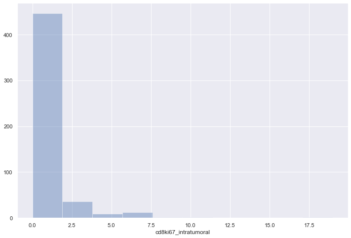


### CD8 in peritumoral lymphocytes


```python
create_descriptive('cd8_peritumoral')
```


<div>
<style scoped>
    .dataframe tbody tr th:only-of-type {
        vertical-align: middle;
    }

    .dataframe tbody tr th {
        vertical-align: top;
    }

    .dataframe thead th {
        text-align: right;
    }
</style>
<table border="1" class="dataframe">
  <thead>
    <tr style="text-align: right;">
      <th></th>
      <th>cd8_peritumoral</th>
    </tr>
  </thead>
  <tbody>
    <tr>
      <th>count</th>
      <td>503.0</td>
    </tr>
    <tr>
      <th>mean</th>
      <td>27.0</td>
    </tr>
    <tr>
      <th>std</th>
      <td>27.0</td>
    </tr>
    <tr>
      <th>min</th>
      <td>0.0</td>
    </tr>
    <tr>
      <th>25%</th>
      <td>5.0</td>
    </tr>
    <tr>
      <th>50%</th>
      <td>19.0</td>
    </tr>
    <tr>
      <th>75%</th>
      <td>40.0</td>
    </tr>
    <tr>
      <th>max</th>
      <td>150.0</td>
    </tr>
  </tbody>
</table>
</div>


```python
plot_kde('cd8_peritumoral')
```


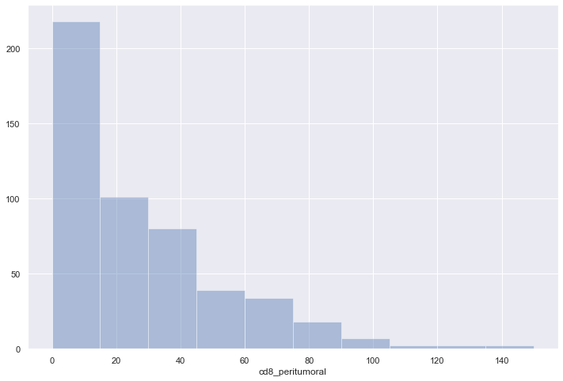


### CD8-Ki67 in peritumoral lymphocytes


```python
create_descriptive('cd8ki67_peritumoral')
```


<div>
<style scoped>
    .dataframe tbody tr th:only-of-type {
        vertical-align: middle;
    }

    .dataframe tbody tr th {
        vertical-align: top;
    }

    .dataframe thead th {
        text-align: right;
    }
</style>
<table border="1" class="dataframe">
  <thead>
    <tr style="text-align: right;">
      <th></th>
      <th>cd8ki67_peritumoral</th>
    </tr>
  </thead>
  <tbody>
    <tr>
      <th>count</th>
      <td>501.0</td>
    </tr>
    <tr>
      <th>mean</th>
      <td>1.0</td>
    </tr>
    <tr>
      <th>std</th>
      <td>2.0</td>
    </tr>
    <tr>
      <th>min</th>
      <td>0.0</td>
    </tr>
    <tr>
      <th>25%</th>
      <td>0.0</td>
    </tr>
    <tr>
      <th>50%</th>
      <td>0.0</td>
    </tr>
    <tr>
      <th>75%</th>
      <td>0.0</td>
    </tr>
    <tr>
      <th>max</th>
      <td>23.0</td>
    </tr>
  </tbody>
</table>
</div>


```python
plot_kde('cd8ki67_peritumoral')
```


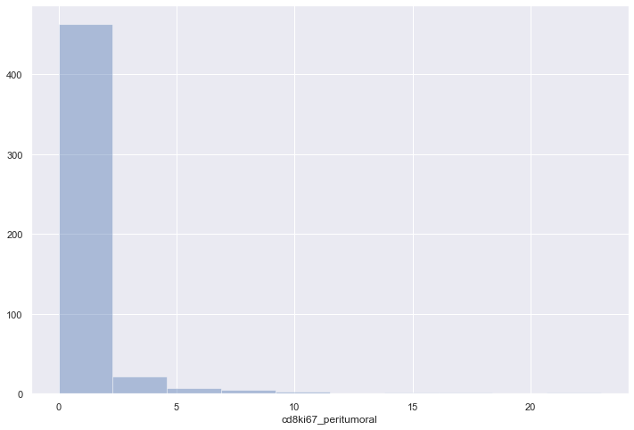


## Histologic subtype

### CD8 in intratumoral lymphocytes


```python
create_descriptives('cd8_intratumoral', 'subtype')
```


<div>
<style scoped>
    .dataframe tbody tr th:only-of-type {
        vertical-align: middle;
    }

    .dataframe tbody tr th {
        vertical-align: top;
    }

    .dataframe thead th {
        text-align: right;
    }
</style>
<table border="1" class="dataframe">
  <thead>
    <tr style="text-align: right;">
      <th></th>
      <th>count</th>
      <th>mean</th>
      <th>std</th>
      <th>min</th>
      <th>25%</th>
      <th>50%</th>
      <th>75%</th>
      <th>max</th>
    </tr>
    <tr>
      <th>subtype</th>
      <th></th>
      <th></th>
      <th></th>
      <th></th>
      <th></th>
      <th></th>
      <th></th>
      <th></th>
    </tr>
  </thead>
  <tbody>
    <tr>
      <th>Usual</th>
      <td>197.0</td>
      <td>12.0</td>
      <td>19.0</td>
      <td>0.0</td>
      <td>0.0</td>
      <td>6.0</td>
      <td>16.0</td>
      <td>120.0</td>
    </tr>
    <tr>
      <th>Basaloid</th>
      <td>62.0</td>
      <td>11.0</td>
      <td>15.0</td>
      <td>0.0</td>
      <td>1.0</td>
      <td>6.0</td>
      <td>12.0</td>
      <td>60.0</td>
    </tr>
    <tr>
      <th>Warty</th>
      <td>78.0</td>
      <td>5.0</td>
      <td>12.0</td>
      <td>0.0</td>
      <td>0.0</td>
      <td>2.0</td>
      <td>5.0</td>
      <td>65.0</td>
    </tr>
    <tr>
      <th>Warty-Basaloid</th>
      <td>117.0</td>
      <td>11.0</td>
      <td>14.0</td>
      <td>0.0</td>
      <td>0.0</td>
      <td>6.0</td>
      <td>16.0</td>
      <td>63.0</td>
    </tr>
    <tr>
      <th>Papillary</th>
      <td>42.0</td>
      <td>6.0</td>
      <td>8.0</td>
      <td>0.0</td>
      <td>0.0</td>
      <td>4.0</td>
      <td>9.0</td>
      <td>32.0</td>
    </tr>
    <tr>
      <th>Verrucous</th>
      <td>7.0</td>
      <td>2.0</td>
      <td>3.0</td>
      <td>0.0</td>
      <td>0.0</td>
      <td>0.0</td>
      <td>2.0</td>
      <td>9.0</td>
    </tr>
    <tr>
      <th>Sarcomatoid</th>
      <td>3.0</td>
      <td>5.0</td>
      <td>2.0</td>
      <td>3.0</td>
      <td>4.0</td>
      <td>6.0</td>
      <td>6.0</td>
      <td>7.0</td>
    </tr>
  </tbody>
</table>
</div>


```python
plot_box('cd8_intratumoral', 'subtype')
```


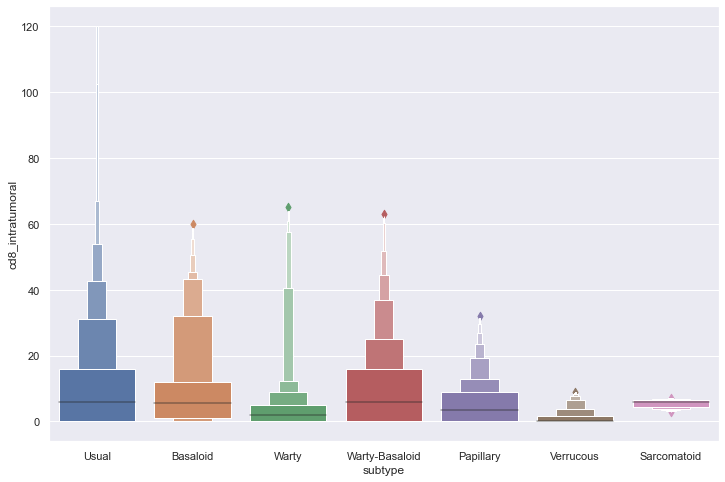


```python
do_kw('cd8_intratumoral', 'subtype')
```

    Kruskal-Wallis statistic: 22.9353
    P value: 0.000818443
    

### CD8-Ki67 in intratumoral lymphocytes


```python
create_descriptives('cd8ki67_intratumoral', 'subtype')
```


<div>
<style scoped>
    .dataframe tbody tr th:only-of-type {
        vertical-align: middle;
    }

    .dataframe tbody tr th {
        vertical-align: top;
    }

    .dataframe thead th {
        text-align: right;
    }
</style>
<table border="1" class="dataframe">
  <thead>
    <tr style="text-align: right;">
      <th></th>
      <th>count</th>
      <th>mean</th>
      <th>std</th>
      <th>min</th>
      <th>25%</th>
      <th>50%</th>
      <th>75%</th>
      <th>max</th>
    </tr>
    <tr>
      <th>subtype</th>
      <th></th>
      <th></th>
      <th></th>
      <th></th>
      <th></th>
      <th></th>
      <th></th>
      <th></th>
    </tr>
  </thead>
  <tbody>
    <tr>
      <th>Usual</th>
      <td>197.0</td>
      <td>0.0</td>
      <td>1.0</td>
      <td>0.0</td>
      <td>0.0</td>
      <td>0.0</td>
      <td>0.0</td>
      <td>10.0</td>
    </tr>
    <tr>
      <th>Basaloid</th>
      <td>62.0</td>
      <td>1.0</td>
      <td>2.0</td>
      <td>0.0</td>
      <td>0.0</td>
      <td>0.0</td>
      <td>1.0</td>
      <td>8.0</td>
    </tr>
    <tr>
      <th>Warty</th>
      <td>78.0</td>
      <td>1.0</td>
      <td>1.0</td>
      <td>0.0</td>
      <td>0.0</td>
      <td>0.0</td>
      <td>0.0</td>
      <td>6.0</td>
    </tr>
    <tr>
      <th>Warty-Basaloid</th>
      <td>117.0</td>
      <td>0.0</td>
      <td>1.0</td>
      <td>0.0</td>
      <td>0.0</td>
      <td>0.0</td>
      <td>0.0</td>
      <td>7.0</td>
    </tr>
    <tr>
      <th>Papillary</th>
      <td>42.0</td>
      <td>0.0</td>
      <td>1.0</td>
      <td>0.0</td>
      <td>0.0</td>
      <td>0.0</td>
      <td>0.0</td>
      <td>3.0</td>
    </tr>
    <tr>
      <th>Verrucous</th>
      <td>7.0</td>
      <td>0.0</td>
      <td>0.0</td>
      <td>0.0</td>
      <td>0.0</td>
      <td>0.0</td>
      <td>0.0</td>
      <td>0.0</td>
    </tr>
    <tr>
      <th>Sarcomatoid</th>
      <td>3.0</td>
      <td>10.0</td>
      <td>8.0</td>
      <td>6.0</td>
      <td>6.0</td>
      <td>6.0</td>
      <td>12.0</td>
      <td>19.0</td>
    </tr>
  </tbody>
</table>
</div>


```python
plot_box('cd8ki67_intratumoral', 'subtype')
```


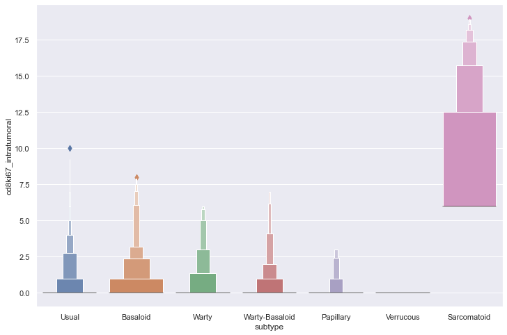


```python
do_kw('cd8ki67_intratumoral', 'subtype')
```

    Kruskal-Wallis statistic: 29.5362
    P value: 4.81465e-05
    

### CD8 in peritumoral lymphocytes


```python
create_descriptives('cd8_peritumoral', 'subtype')
```


<div>
<style scoped>
    .dataframe tbody tr th:only-of-type {
        vertical-align: middle;
    }

    .dataframe tbody tr th {
        vertical-align: top;
    }

    .dataframe thead th {
        text-align: right;
    }
</style>
<table border="1" class="dataframe">
  <thead>
    <tr style="text-align: right;">
      <th></th>
      <th>count</th>
      <th>mean</th>
      <th>std</th>
      <th>min</th>
      <th>25%</th>
      <th>50%</th>
      <th>75%</th>
      <th>max</th>
    </tr>
    <tr>
      <th>subtype</th>
      <th></th>
      <th></th>
      <th></th>
      <th></th>
      <th></th>
      <th></th>
      <th></th>
      <th></th>
    </tr>
  </thead>
  <tbody>
    <tr>
      <th>Usual</th>
      <td>198.0</td>
      <td>29.0</td>
      <td>29.0</td>
      <td>0.0</td>
      <td>7.0</td>
      <td>22.0</td>
      <td>43.0</td>
      <td>150.0</td>
    </tr>
    <tr>
      <th>Basaloid</th>
      <td>59.0</td>
      <td>25.0</td>
      <td>20.0</td>
      <td>0.0</td>
      <td>10.0</td>
      <td>19.0</td>
      <td>36.0</td>
      <td>75.0</td>
    </tr>
    <tr>
      <th>Warty</th>
      <td>78.0</td>
      <td>22.0</td>
      <td>25.0</td>
      <td>0.0</td>
      <td>0.0</td>
      <td>14.0</td>
      <td>34.0</td>
      <td>101.0</td>
    </tr>
    <tr>
      <th>Warty-Basaloid</th>
      <td>116.0</td>
      <td>27.0</td>
      <td>27.0</td>
      <td>0.0</td>
      <td>4.0</td>
      <td>20.0</td>
      <td>42.0</td>
      <td>116.0</td>
    </tr>
    <tr>
      <th>Papillary</th>
      <td>42.0</td>
      <td>28.0</td>
      <td>30.0</td>
      <td>0.0</td>
      <td>1.0</td>
      <td>20.0</td>
      <td>43.0</td>
      <td>98.0</td>
    </tr>
    <tr>
      <th>Verrucous</th>
      <td>7.0</td>
      <td>14.0</td>
      <td>13.0</td>
      <td>0.0</td>
      <td>0.0</td>
      <td>23.0</td>
      <td>24.0</td>
      <td>26.0</td>
    </tr>
    <tr>
      <th>Sarcomatoid</th>
      <td>3.0</td>
      <td>12.0</td>
      <td>6.0</td>
      <td>5.0</td>
      <td>10.0</td>
      <td>14.0</td>
      <td>16.0</td>
      <td>17.0</td>
    </tr>
  </tbody>
</table>
</div>


```python
plot_box('cd8_peritumoral', 'subtype')
```


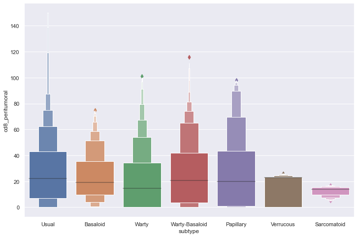


```python
do_kw('cd8_peritumoral', 'subtype')
```

    Kruskal-Wallis statistic: 7.42373
    P value: 0.283431
    

### CD8-Ki67 in peritumoral lymphocytes


```python
create_descriptives('cd8ki67_peritumoral', 'subtype')
```


<div>
<style scoped>
    .dataframe tbody tr th:only-of-type {
        vertical-align: middle;
    }

    .dataframe tbody tr th {
        vertical-align: top;
    }

    .dataframe thead th {
        text-align: right;
    }
</style>
<table border="1" class="dataframe">
  <thead>
    <tr style="text-align: right;">
      <th></th>
      <th>count</th>
      <th>mean</th>
      <th>std</th>
      <th>min</th>
      <th>25%</th>
      <th>50%</th>
      <th>75%</th>
      <th>max</th>
    </tr>
    <tr>
      <th>subtype</th>
      <th></th>
      <th></th>
      <th></th>
      <th></th>
      <th></th>
      <th></th>
      <th></th>
      <th></th>
    </tr>
  </thead>
  <tbody>
    <tr>
      <th>Usual</th>
      <td>197.0</td>
      <td>0.0</td>
      <td>1.0</td>
      <td>0.0</td>
      <td>0.0</td>
      <td>0.0</td>
      <td>0.0</td>
      <td>7.0</td>
    </tr>
    <tr>
      <th>Basaloid</th>
      <td>59.0</td>
      <td>1.0</td>
      <td>3.0</td>
      <td>0.0</td>
      <td>0.0</td>
      <td>0.0</td>
      <td>0.0</td>
      <td>17.0</td>
    </tr>
    <tr>
      <th>Warty</th>
      <td>77.0</td>
      <td>1.0</td>
      <td>2.0</td>
      <td>0.0</td>
      <td>0.0</td>
      <td>0.0</td>
      <td>0.0</td>
      <td>8.0</td>
    </tr>
    <tr>
      <th>Warty-Basaloid</th>
      <td>116.0</td>
      <td>0.0</td>
      <td>1.0</td>
      <td>0.0</td>
      <td>0.0</td>
      <td>0.0</td>
      <td>0.0</td>
      <td>10.0</td>
    </tr>
    <tr>
      <th>Papillary</th>
      <td>42.0</td>
      <td>0.0</td>
      <td>1.0</td>
      <td>0.0</td>
      <td>0.0</td>
      <td>0.0</td>
      <td>0.0</td>
      <td>4.0</td>
    </tr>
    <tr>
      <th>Verrucous</th>
      <td>7.0</td>
      <td>0.0</td>
      <td>0.0</td>
      <td>0.0</td>
      <td>0.0</td>
      <td>0.0</td>
      <td>0.0</td>
      <td>0.0</td>
    </tr>
    <tr>
      <th>Sarcomatoid</th>
      <td>3.0</td>
      <td>16.0</td>
      <td>7.0</td>
      <td>10.0</td>
      <td>12.0</td>
      <td>14.0</td>
      <td>18.0</td>
      <td>23.0</td>
    </tr>
  </tbody>
</table>
</div>


```python
plot_box('cd8ki67_peritumoral', 'subtype')
```


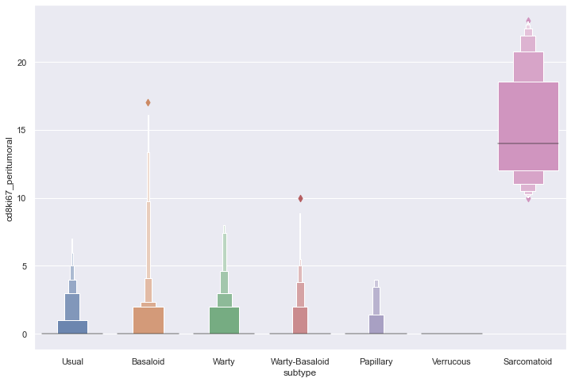


```python
do_kw('cd8ki67_peritumoral', 'subtype')
```

    Kruskal-Wallis statistic: 28.2881
    P value: 8.29192e-05
    

## Histologic grade

### CD8 in intratumoral lymphocytes


```python
create_descriptives('cd8_intratumoral','grade')
```


<div>
<style scoped>
    .dataframe tbody tr th:only-of-type {
        vertical-align: middle;
    }

    .dataframe tbody tr th {
        vertical-align: top;
    }

    .dataframe thead th {
        text-align: right;
    }
</style>
<table border="1" class="dataframe">
  <thead>
    <tr style="text-align: right;">
      <th></th>
      <th>count</th>
      <th>mean</th>
      <th>std</th>
      <th>min</th>
      <th>25%</th>
      <th>50%</th>
      <th>75%</th>
      <th>max</th>
    </tr>
    <tr>
      <th>grade</th>
      <th></th>
      <th></th>
      <th></th>
      <th></th>
      <th></th>
      <th></th>
      <th></th>
      <th></th>
    </tr>
  </thead>
  <tbody>
    <tr>
      <th>Grade 1</th>
      <td>50.0</td>
      <td>6.0</td>
      <td>10.0</td>
      <td>0.0</td>
      <td>0.0</td>
      <td>1.0</td>
      <td>9.0</td>
      <td>46.0</td>
    </tr>
    <tr>
      <th>Grade 2</th>
      <td>188.0</td>
      <td>8.0</td>
      <td>12.0</td>
      <td>0.0</td>
      <td>0.0</td>
      <td>2.0</td>
      <td>10.0</td>
      <td>58.0</td>
    </tr>
    <tr>
      <th>Grade 3</th>
      <td>256.0</td>
      <td>13.0</td>
      <td>18.0</td>
      <td>0.0</td>
      <td>1.0</td>
      <td>6.0</td>
      <td>15.0</td>
      <td>120.0</td>
    </tr>
  </tbody>
</table>
</div>


```python
plot_box('cd8_intratumoral','grade')
```


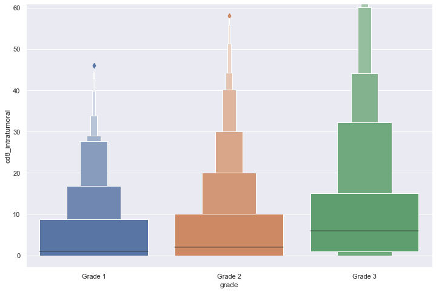


```python
plot_point('cd8_intratumoral','grade')
```


```python
do_kw('cd8_intratumoral','grade')
```

    Kruskal-Wallis statistic: 23.1739
    P value: 9.28663e-06
    

### CD8-Ki67 in intratumoral lymphocytes


```python
create_descriptives('cd8ki67_intratumoral','grade')
```


<div>
<style scoped>
    .dataframe tbody tr th:only-of-type {
        vertical-align: middle;
    }

    .dataframe tbody tr th {
        vertical-align: top;
    }

    .dataframe thead th {
        text-align: right;
    }
</style>
<table border="1" class="dataframe">
  <thead>
    <tr style="text-align: right;">
      <th></th>
      <th>count</th>
      <th>mean</th>
      <th>std</th>
      <th>min</th>
      <th>25%</th>
      <th>50%</th>
      <th>75%</th>
      <th>max</th>
    </tr>
    <tr>
      <th>grade</th>
      <th></th>
      <th></th>
      <th></th>
      <th></th>
      <th></th>
      <th></th>
      <th></th>
      <th></th>
    </tr>
  </thead>
  <tbody>
    <tr>
      <th>Grade 1</th>
      <td>50.0</td>
      <td>0.0</td>
      <td>1.0</td>
      <td>0.0</td>
      <td>0.0</td>
      <td>0.0</td>
      <td>0.0</td>
      <td>4.0</td>
    </tr>
    <tr>
      <th>Grade 2</th>
      <td>188.0</td>
      <td>0.0</td>
      <td>1.0</td>
      <td>0.0</td>
      <td>0.0</td>
      <td>0.0</td>
      <td>0.0</td>
      <td>6.0</td>
    </tr>
    <tr>
      <th>Grade 3</th>
      <td>256.0</td>
      <td>1.0</td>
      <td>2.0</td>
      <td>0.0</td>
      <td>0.0</td>
      <td>0.0</td>
      <td>0.0</td>
      <td>19.0</td>
    </tr>
  </tbody>
</table>
</div>


```python
plot_box('cd8ki67_intratumoral','grade')
```


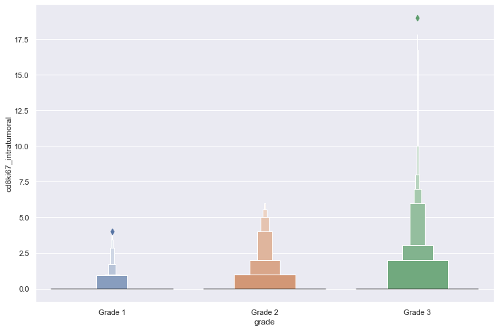


```python
plot_point('cd8ki67_intratumoral','grade')
```


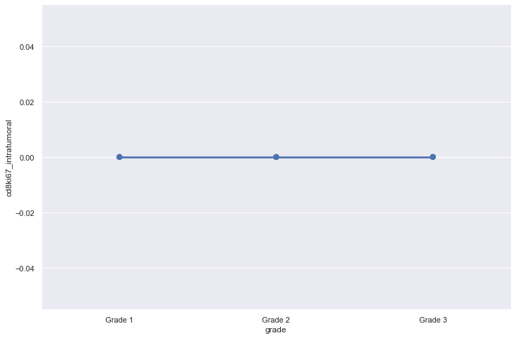


```python
do_kw('cd8ki67_intratumoral','grade')
```

    Kruskal-Wallis statistic: 13.7238
    P value: 0.00104694
    

### CD8 in peritumoral lymphocytes


```python
create_descriptives('cd8_peritumoral','grade')
```


<div>
<style scoped>
    .dataframe tbody tr th:only-of-type {
        vertical-align: middle;
    }

    .dataframe tbody tr th {
        vertical-align: top;
    }

    .dataframe thead th {
        text-align: right;
    }
</style>
<table border="1" class="dataframe">
  <thead>
    <tr style="text-align: right;">
      <th></th>
      <th>count</th>
      <th>mean</th>
      <th>std</th>
      <th>min</th>
      <th>25%</th>
      <th>50%</th>
      <th>75%</th>
      <th>max</th>
    </tr>
    <tr>
      <th>grade</th>
      <th></th>
      <th></th>
      <th></th>
      <th></th>
      <th></th>
      <th></th>
      <th></th>
      <th></th>
    </tr>
  </thead>
  <tbody>
    <tr>
      <th>Grade 1</th>
      <td>50.0</td>
      <td>26.0</td>
      <td>23.0</td>
      <td>0.0</td>
      <td>7.0</td>
      <td>24.0</td>
      <td>40.0</td>
      <td>95.0</td>
    </tr>
    <tr>
      <th>Grade 2</th>
      <td>190.0</td>
      <td>28.0</td>
      <td>30.0</td>
      <td>0.0</td>
      <td>4.0</td>
      <td>16.0</td>
      <td>44.0</td>
      <td>150.0</td>
    </tr>
    <tr>
      <th>Grade 3</th>
      <td>245.0</td>
      <td>25.0</td>
      <td>24.0</td>
      <td>0.0</td>
      <td>5.0</td>
      <td>19.0</td>
      <td>40.0</td>
      <td>150.0</td>
    </tr>
  </tbody>
</table>
</div>


```python
plot_box('cd8_peritumoral','grade')
```


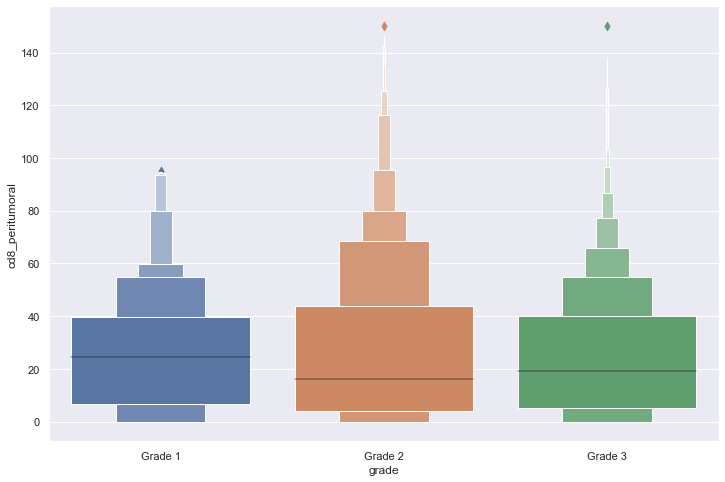


```python
plot_point('cd8_peritumoral','grade')
```


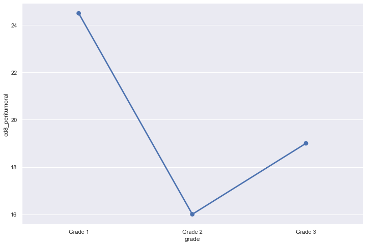


```python
do_kw('cd8_peritumoral','grade')
```

    Kruskal-Wallis statistic: 0.170261
    P value: 0.918392
    

### CD8-Ki67 in peritumoral lymphocytes


```python
create_descriptives('cd8ki67_peritumoral','grade')
```


<div>
<style scoped>
    .dataframe tbody tr th:only-of-type {
        vertical-align: middle;
    }

    .dataframe tbody tr th {
        vertical-align: top;
    }

    .dataframe thead th {
        text-align: right;
    }
</style>
<table border="1" class="dataframe">
  <thead>
    <tr style="text-align: right;">
      <th></th>
      <th>count</th>
      <th>mean</th>
      <th>std</th>
      <th>min</th>
      <th>25%</th>
      <th>50%</th>
      <th>75%</th>
      <th>max</th>
    </tr>
    <tr>
      <th>grade</th>
      <th></th>
      <th></th>
      <th></th>
      <th></th>
      <th></th>
      <th></th>
      <th></th>
      <th></th>
    </tr>
  </thead>
  <tbody>
    <tr>
      <th>Grade 1</th>
      <td>50.0</td>
      <td>0.0</td>
      <td>1.0</td>
      <td>0.0</td>
      <td>0.0</td>
      <td>0.0</td>
      <td>0.0</td>
      <td>4.0</td>
    </tr>
    <tr>
      <th>Grade 2</th>
      <td>190.0</td>
      <td>0.0</td>
      <td>1.0</td>
      <td>0.0</td>
      <td>0.0</td>
      <td>0.0</td>
      <td>0.0</td>
      <td>5.0</td>
    </tr>
    <tr>
      <th>Grade 3</th>
      <td>244.0</td>
      <td>1.0</td>
      <td>3.0</td>
      <td>0.0</td>
      <td>0.0</td>
      <td>0.0</td>
      <td>0.0</td>
      <td>23.0</td>
    </tr>
  </tbody>
</table>
</div>


```python
plot_box('cd8ki67_peritumoral','grade')
```


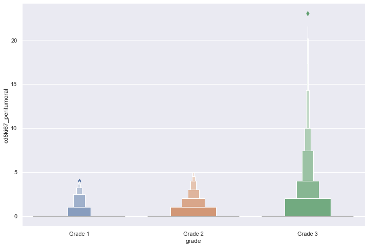


```python
plot_point('cd8ki67_peritumoral','grade')
```


```python
do_kw('cd8ki67_peritumoral','grade')
```

    Kruskal-Wallis statistic: 5.80726
    P value: 0.0548237
    

## Host response

### CD8 in intratumoral lymphocytes


```python
create_descriptives('cd8_intratumoral','host_response')
```


<div>
<style scoped>
    .dataframe tbody tr th:only-of-type {
        vertical-align: middle;
    }

    .dataframe tbody tr th {
        vertical-align: top;
    }

    .dataframe thead th {
        text-align: right;
    }
</style>
<table border="1" class="dataframe">
  <thead>
    <tr style="text-align: right;">
      <th></th>
      <th>count</th>
      <th>mean</th>
      <th>std</th>
      <th>min</th>
      <th>25%</th>
      <th>50%</th>
      <th>75%</th>
      <th>max</th>
    </tr>
    <tr>
      <th>host_response</th>
      <th></th>
      <th></th>
      <th></th>
      <th></th>
      <th></th>
      <th></th>
      <th></th>
      <th></th>
    </tr>
  </thead>
  <tbody>
    <tr>
      <th>No</th>
      <td>3.0</td>
      <td>0.0</td>
      <td>0.0</td>
      <td>0.0</td>
      <td>0.0</td>
      <td>0.0</td>
      <td>0.0</td>
      <td>0.0</td>
    </tr>
    <tr>
      <th>Mild</th>
      <td>96.0</td>
      <td>5.0</td>
      <td>9.0</td>
      <td>0.0</td>
      <td>0.0</td>
      <td>2.0</td>
      <td>5.0</td>
      <td>46.0</td>
    </tr>
    <tr>
      <th>Moderate</th>
      <td>151.0</td>
      <td>7.0</td>
      <td>12.0</td>
      <td>0.0</td>
      <td>0.0</td>
      <td>2.0</td>
      <td>10.0</td>
      <td>62.0</td>
    </tr>
    <tr>
      <th>Intense</th>
      <td>243.0</td>
      <td>14.0</td>
      <td>19.0</td>
      <td>0.0</td>
      <td>1.0</td>
      <td>8.0</td>
      <td>20.0</td>
      <td>120.0</td>
    </tr>
  </tbody>
</table>
</div>


```python
plot_box('cd8_intratumoral','host_response')
```


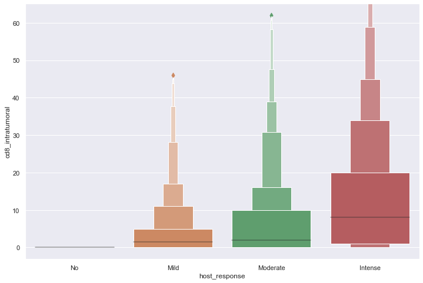


```python
plot_point('cd8_intratumoral','host_response')
```


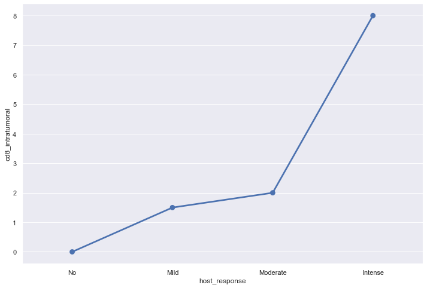


```python
do_kw('cd8_intratumoral','host_response')
```

    Kruskal-Wallis statistic: 46.5498
    P value: 4.33289e-10
    

### CD8 in intratumoral lymphocytes


```python
create_descriptives('cd8ki67_intratumoral','host_response')
```


<div>
<style scoped>
    .dataframe tbody tr th:only-of-type {
        vertical-align: middle;
    }

    .dataframe tbody tr th {
        vertical-align: top;
    }

    .dataframe thead th {
        text-align: right;
    }
</style>
<table border="1" class="dataframe">
  <thead>
    <tr style="text-align: right;">
      <th></th>
      <th>count</th>
      <th>mean</th>
      <th>std</th>
      <th>min</th>
      <th>25%</th>
      <th>50%</th>
      <th>75%</th>
      <th>max</th>
    </tr>
    <tr>
      <th>host_response</th>
      <th></th>
      <th></th>
      <th></th>
      <th></th>
      <th></th>
      <th></th>
      <th></th>
      <th></th>
    </tr>
  </thead>
  <tbody>
    <tr>
      <th>No</th>
      <td>3.0</td>
      <td>0.0</td>
      <td>0.0</td>
      <td>0.0</td>
      <td>0.0</td>
      <td>0.0</td>
      <td>0.0</td>
      <td>0.0</td>
    </tr>
    <tr>
      <th>Mild</th>
      <td>96.0</td>
      <td>0.0</td>
      <td>1.0</td>
      <td>0.0</td>
      <td>0.0</td>
      <td>0.0</td>
      <td>0.0</td>
      <td>6.0</td>
    </tr>
    <tr>
      <th>Moderate</th>
      <td>151.0</td>
      <td>0.0</td>
      <td>1.0</td>
      <td>0.0</td>
      <td>0.0</td>
      <td>0.0</td>
      <td>0.0</td>
      <td>7.0</td>
    </tr>
    <tr>
      <th>Intense</th>
      <td>243.0</td>
      <td>1.0</td>
      <td>2.0</td>
      <td>0.0</td>
      <td>0.0</td>
      <td>0.0</td>
      <td>1.0</td>
      <td>19.0</td>
    </tr>
  </tbody>
</table>
</div>


```python
plot_box('cd8ki67_intratumoral','host_response')
```


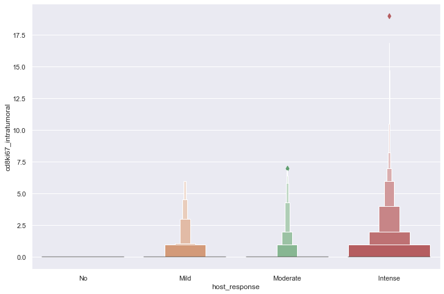


```python
plot_point('cd8ki67_intratumoral','host_response')
```


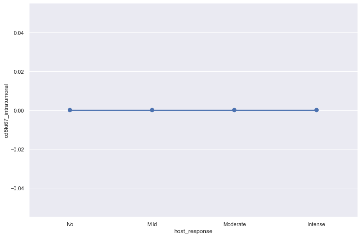


```python
do_kw('cd8ki67_intratumoral','host_response')
```

    Kruskal-Wallis statistic: 23.5031
    P value: 3.1717e-05
    

### CD8 in peritumoral lymphocytes


```python
create_descriptives('cd8_peritumoral','host_response')
```


<div>
<style scoped>
    .dataframe tbody tr th:only-of-type {
        vertical-align: middle;
    }

    .dataframe tbody tr th {
        vertical-align: top;
    }

    .dataframe thead th {
        text-align: right;
    }
</style>
<table border="1" class="dataframe">
  <thead>
    <tr style="text-align: right;">
      <th></th>
      <th>count</th>
      <th>mean</th>
      <th>std</th>
      <th>min</th>
      <th>25%</th>
      <th>50%</th>
      <th>75%</th>
      <th>max</th>
    </tr>
    <tr>
      <th>host_response</th>
      <th></th>
      <th></th>
      <th></th>
      <th></th>
      <th></th>
      <th></th>
      <th></th>
      <th></th>
    </tr>
  </thead>
  <tbody>
    <tr>
      <th>No</th>
      <td>3.0</td>
      <td>6.0</td>
      <td>11.0</td>
      <td>0.0</td>
      <td>0.0</td>
      <td>0.0</td>
      <td>10.0</td>
      <td>19.0</td>
    </tr>
    <tr>
      <th>Mild</th>
      <td>88.0</td>
      <td>9.0</td>
      <td>13.0</td>
      <td>0.0</td>
      <td>0.0</td>
      <td>4.0</td>
      <td>12.0</td>
      <td>64.0</td>
    </tr>
    <tr>
      <th>Moderate</th>
      <td>152.0</td>
      <td>19.0</td>
      <td>20.0</td>
      <td>0.0</td>
      <td>4.0</td>
      <td>12.0</td>
      <td>27.0</td>
      <td>93.0</td>
    </tr>
    <tr>
      <th>Intense</th>
      <td>242.0</td>
      <td>38.0</td>
      <td>29.0</td>
      <td>0.0</td>
      <td>15.0</td>
      <td>32.0</td>
      <td>56.0</td>
      <td>150.0</td>
    </tr>
  </tbody>
</table>
</div>


```python
plot_box('cd8_peritumoral','host_response')
```


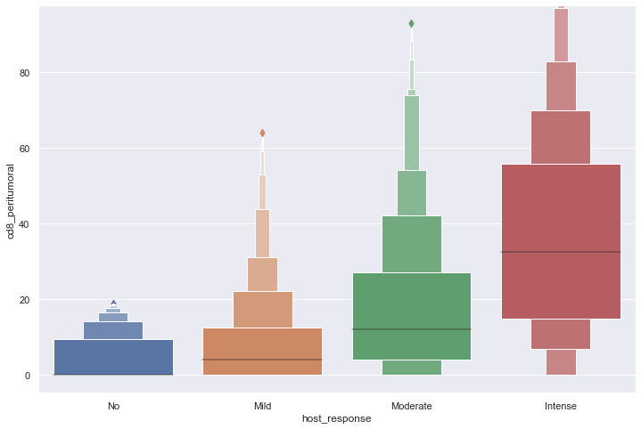


```python
plot_point('cd8_peritumoral','host_response')
```


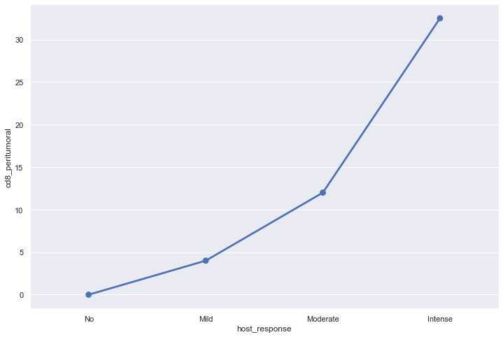


```python
do_kw('cd8_peritumoral','host_response')
```

    Kruskal-Wallis statistic: 115.481
    P value: 7.25283e-25
    

### CD8-Ki67 in peritumoral lymphocytes


```python
create_descriptives('cd8ki67_peritumoral','host_response')
```


<div>
<style scoped>
    .dataframe tbody tr th:only-of-type {
        vertical-align: middle;
    }

    .dataframe tbody tr th {
        vertical-align: top;
    }

    .dataframe thead th {
        text-align: right;
    }
</style>
<table border="1" class="dataframe">
  <thead>
    <tr style="text-align: right;">
      <th></th>
      <th>count</th>
      <th>mean</th>
      <th>std</th>
      <th>min</th>
      <th>25%</th>
      <th>50%</th>
      <th>75%</th>
      <th>max</th>
    </tr>
    <tr>
      <th>host_response</th>
      <th></th>
      <th></th>
      <th></th>
      <th></th>
      <th></th>
      <th></th>
      <th></th>
      <th></th>
    </tr>
  </thead>
  <tbody>
    <tr>
      <th>No</th>
      <td>3.0</td>
      <td>0.0</td>
      <td>0.0</td>
      <td>0.0</td>
      <td>0.0</td>
      <td>0.0</td>
      <td>0.0</td>
      <td>0.0</td>
    </tr>
    <tr>
      <th>Mild</th>
      <td>88.0</td>
      <td>0.0</td>
      <td>1.0</td>
      <td>0.0</td>
      <td>0.0</td>
      <td>0.0</td>
      <td>0.0</td>
      <td>3.0</td>
    </tr>
    <tr>
      <th>Moderate</th>
      <td>151.0</td>
      <td>0.0</td>
      <td>1.0</td>
      <td>0.0</td>
      <td>0.0</td>
      <td>0.0</td>
      <td>0.0</td>
      <td>17.0</td>
    </tr>
    <tr>
      <th>Intense</th>
      <td>242.0</td>
      <td>1.0</td>
      <td>2.0</td>
      <td>0.0</td>
      <td>0.0</td>
      <td>0.0</td>
      <td>1.0</td>
      <td>23.0</td>
    </tr>
  </tbody>
</table>
</div>


```python
plot_box('cd8ki67_peritumoral','host_response')
```


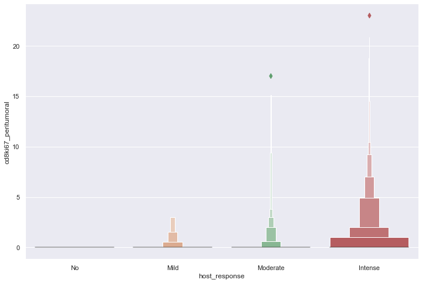


```python
plot_point('cd8ki67_peritumoral','host_response')
```


```python
do_kw('cd8ki67_peritumoral','host_response')
```

    Kruskal-Wallis statistic: 37.4278
    P value: 3.7357e-08
    

## Correlation matrix


```python
vars = ['cd8_intratumoral','cd8ki67_intratumoral','cd8_peritumoral','cd8ki67_peritumoral']
```

### Pairplot


```python
plot_pair(vars)
```


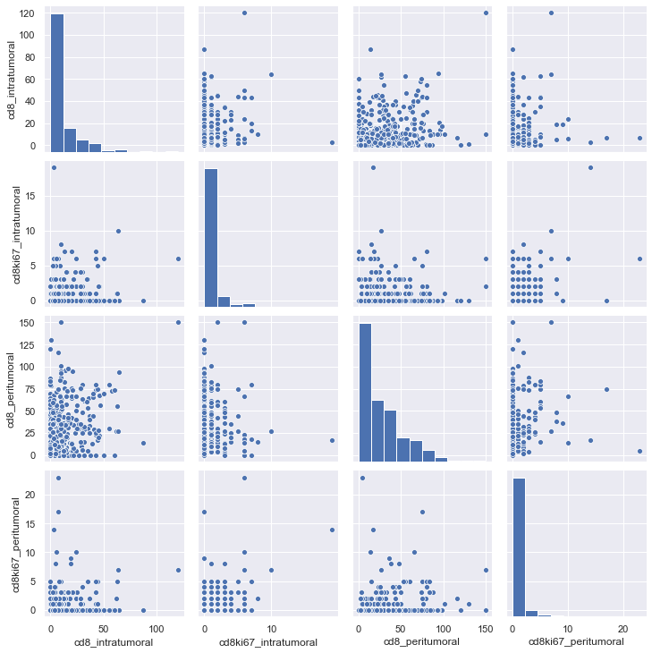


### Correlation coefficients


```python
do_spearman_rho(vars)
```


<div>
<style scoped>
    .dataframe tbody tr th:only-of-type {
        vertical-align: middle;
    }

    .dataframe tbody tr th {
        vertical-align: top;
    }

    .dataframe thead th {
        text-align: right;
    }
</style>
<table border="1" class="dataframe">
  <thead>
    <tr style="text-align: right;">
      <th></th>
      <th>cd8_intratumoral</th>
      <th>cd8ki67_intratumoral</th>
      <th>cd8_peritumoral</th>
      <th>cd8ki67_peritumoral</th>
    </tr>
  </thead>
  <tbody>
    <tr>
      <th>cd8_intratumoral</th>
      <td>1.00</td>
      <td>0.34</td>
      <td>0.37</td>
      <td>0.23</td>
    </tr>
    <tr>
      <th>cd8ki67_intratumoral</th>
      <td>0.34</td>
      <td>1.00</td>
      <td>0.13</td>
      <td>0.54</td>
    </tr>
    <tr>
      <th>cd8_peritumoral</th>
      <td>0.37</td>
      <td>0.13</td>
      <td>1.00</td>
      <td>0.24</td>
    </tr>
    <tr>
      <th>cd8ki67_peritumoral</th>
      <td>0.23</td>
      <td>0.54</td>
      <td>0.24</td>
      <td>1.00</td>
    </tr>
  </tbody>
</table>
</div>


### P values


```python
do_spearman_p(vars)
```


<div>
<style scoped>
    .dataframe tbody tr th:only-of-type {
        vertical-align: middle;
    }

    .dataframe tbody tr th {
        vertical-align: top;
    }

    .dataframe thead th {
        text-align: right;
    }
</style>
<table border="1" class="dataframe">
  <thead>
    <tr style="text-align: right;">
      <th></th>
      <th>cd8_intratumoral</th>
      <th>cd8ki67_intratumoral</th>
      <th>cd8_peritumoral</th>
      <th>cd8ki67_peritumoral</th>
    </tr>
  </thead>
  <tbody>
    <tr>
      <th>cd8_intratumoral</th>
      <td>0.000000e+00</td>
      <td>4.455658e-15</td>
      <td>2.030085e-17</td>
      <td>1.307078e-07</td>
    </tr>
    <tr>
      <th>cd8ki67_intratumoral</th>
      <td>4.455658e-15</td>
      <td>0.000000e+00</td>
      <td>5.047091e-03</td>
      <td>8.730021e-39</td>
    </tr>
    <tr>
      <th>cd8_peritumoral</th>
      <td>2.030085e-17</td>
      <td>5.047091e-03</td>
      <td>0.000000e+00</td>
      <td>6.753710e-08</td>
    </tr>
    <tr>
      <th>cd8ki67_peritumoral</th>
      <td>1.307078e-07</td>
      <td>8.730021e-39</td>
      <td>6.753710e-08</td>
      <td>0.000000e+00</td>
    </tr>
  </tbody>
</table>
</div>


## Impact of pathologic features

### CD8 in intratumoral lymphocytes


```python
get_all_scores('cd8_intratumoral')
```

    Variance explained by ['subtype']: 7.74533
    Variance explained by ['grade']: -5.00625
    Variance explained by ['host_response']: 15.0271
    Variance explained by ['subtype', 'grade']: 5.3277
    Variance explained by ['host_response', 'grade']: 11.1305
    Variance explained by ['subtype', 'host_response']: 19.4128
    Variance explained by ['subtype', 'grade', 'host_response']: 18.735
    

### CD8-Ki67 in intratumoral lymphocytes


```python
get_all_scores('cd8ki67_intratumoral')
```

    Variance explained by ['subtype']: 1.35337
    Variance explained by ['grade']: -0.0832219
    Variance explained by ['host_response']: -1.0574
    Variance explained by ['subtype', 'grade']: 0.761449
    Variance explained by ['host_response', 'grade']: -0.0975487
    Variance explained by ['subtype', 'host_response']: 1.73479
    Variance explained by ['subtype', 'grade', 'host_response']: 1.53531
    

### CD8 in peritumoral lymphocytes


```python
get_all_scores('cd8_peritumoral')
```

    Variance explained by ['subtype']: 0.352473
    Variance explained by ['grade']: 0.151825
    Variance explained by ['host_response']: 21.1009
    Variance explained by ['subtype', 'grade']: -0.00935259
    Variance explained by ['host_response', 'grade']: 22.9877
    Variance explained by ['subtype', 'host_response']: 20.4234
    Variance explained by ['subtype', 'grade', 'host_response']: 21.1611
    

### CD8-Ki67 in peritumoral lymphocytes


```python
get_all_scores('cd8ki67_peritumoral')
```

    Variance explained by ['subtype']: 50.4013
    Variance explained by ['grade']: 1.71195
    Variance explained by ['host_response']: 4.04579
    Variance explained by ['subtype', 'grade']: 50.8232
    Variance explained by ['host_response', 'grade']: 5.03423
    Variance explained by ['subtype', 'host_response']: 52.2339
    Variance explained by ['subtype', 'grade', 'host_response']: 52.3157
    
